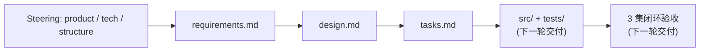
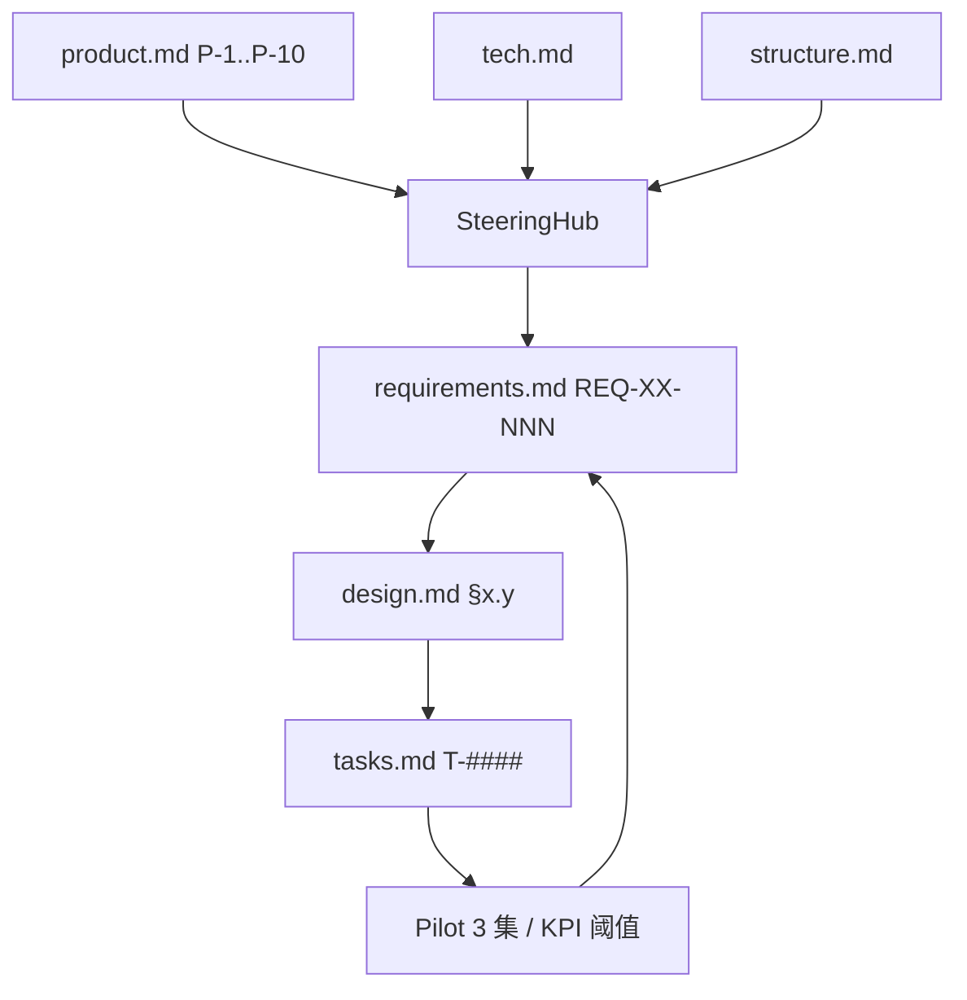

# Spec: ai-manhuaju-autopilot

> Kiro Spec / 顶层索引（Phase 0 / Reading Map）
> Version: 1.0.0  Status: Draft for Confirmation
> Slogan: 一部小说 → N 集人物一致的漫剧视频，**全程无人**，由软件 + Agent 自治产出。

本 Spec 通过 Kiro 三阶段（Requirements → Design → Tasks）锁定一个**世界顶级、完全自动化、可复现、可观测、可降级**的"小说 → 漫剧"工业化流水线。

---

## 0. 项目一句话

```
Input  : 任意中文/英文长篇小说 (≤1,000,000 字) + 全局配置 + seed
Output : N 集 9:16/16:9/1:1 视频 (默认 60 集, 60–180s/集), 跨集人物一致 (ArcFace ≥ 0.92),
         自带配音、BGM、字幕、合规水印, 可直接上线分发
Process: 14 个自治 Agent + 8 类 Adapter + 三层状态机, 全程 0 个人类决策点
Engine : 主路径 = 小云雀 (字节即梦 AI Agent 2.0) + 兜底 Seedance 2.0
Backbone: Pydantic v2 schemas + Prefect + NATS JetStream + Postgres + Qdrant + MinIO + Vault
Trace  : OpenTelemetry + Prometheus + Loki + Tempo + Grafana × 6 dashboards
```

---

## 1. 阅读顺序



| # | 文档 | 用途 | 体量 |
| --- | --- | --- | --- |
| 0 | [`../../steering/product.md`](../../steering/product.md) | 产品价值观 / 10 条不可妥协原则 / KPIs | ~9 KB |
| 0 | [`../../steering/tech.md`](../../steering/tech.md) | 技术栈 / 版本 / SLA / 外部模型 | ~7 KB |
| 0 | [`../../steering/structure.md`](../../steering/structure.md) | 目录 / 命名 / 14 Agent 名录 | ~6 KB |
| 1 | [`./requirements.md`](./requirements.md) | EARS 需求规格（191 条 REQ） | ~80 KB |
| 2 | [`./design.md`](./design.md) | 架构 + 14 Agent 拓扑 + 状态机 + 数据模型 + 4 时序图 + 错误降级矩阵 + 一致性引擎 + 14 条 ADR + 12 风险 | ~48 KB |
| 3 | [`./tasks.md`](./tasks.md) | 8 Epic / 28 Story / 228 Task / DAG / 4 里程碑 | ~40 KB |

> 阅读建议：从 `product.md` 开始，30 分钟掌握项目宪法；再读 `requirements.md` 的 §1-§4 + §18 + §20（约 60 分钟）即可对系统形成完整心智模型。

---

## 2. 双向追溯链 (Provenance of the Spec itself)



每条 EARS REQ 都标注 `Source=P-#` 引到 Steering 原则；每章 Design 都有 §15 反向追踪矩阵；每条 Task 都标注 `REQ:` 反向链接。CI 用 `scripts/build_traceability_matrix.py` 周期校验。

---

## 3. 关键设计承诺（与 Steering 一一对应）

| Steering 原则 | 落地承诺 | 主要证据 |
| --- | --- | --- |
| P-1 Autopilot Only | 状态机 0 个 `WaitForHumanApproval` 节点；CI 静态扫描禁词 (`T-0006`) | `requirements.md §17` + `design §5.4` + `tasks T-0006/T-0367` |
| P-2 Spec-Driven | 每个 Task 反向 REQ；每个 REQ 反向 Steering | 全文 |
| P-3 Determinism | 强制 seed；canonical-JSON SHA；Pilot determinism re-run 阈值 ≥ 95% | `REQ-IN-004 / REQ-PILOT-010` |
| P-4 Quality Gates as Code | 三层 QA + LLM Judge + KPI 阈值 (`config/kpi.yaml`) | `requirements §15 / design §15` |
| P-5 Character Consistency First | 跨集 ArcFace ≥ 0.92 头号 KPI；专章 §18 + 一致性引擎 `design §9` | `REQ-CON-***` |
| P-6 Cost & Latency Aware | Budget 三元组 + 自动降级 | `design §13` |
| P-7 Provenance Everywhere | 每帧/台词/音轨可追溯到源 sentence + prompt + seed | `design §11.5` |
| P-8 Observable by Default | OTel + Prom + Loki + Tempo + 6 Dashboards | `design §11` |
| P-9 Graceful Degradation | XYQ → Seedance Fast → Local placeholder | `design §10` |
| P-10 Globalization Ready | i18n 资源 + 多 locale 输出 | `REQ-NFR-I18N-***` |

---

## 4. 关键统计（自动校验值）

| 指标 | 值 |
| --- | --- |
| Steering 文档数 | 3 |
| EARS REQ 总数 | 191 |
| 唯一 REQ-ID | 191 |
| Design 章节 | 17 |
| Mermaid 图 | 13（含 4 张时序图、3 张状态机、2 张 C4） |
| ADR 数 | 14 |
| 风险登记数 | 12 |
| Task 总数 (v1) | 228 |
| Task 反向 REQ 覆盖 | 100% |
| 项目级"人工节点"数量 | 0（已静态校验） |

---

## 5. 下一阶段（待您确认 Spec 后启动）

确认本 Spec 即默许进入 Phase 4 实施：

1. **M1 工程基线**：Epic 1 + 2 全部完成；Mock 全链路就绪；CI 全绿。
2. **M2 Mock E2E**：Epic 3-6 完成；3 集 Mock Pilot 跑通；Pilot 报告达 KPI 阈值。
3. **M3 Live 3-Ep Pilot**：Epic 7 真链路；1 集 Live + 3 集 Mock 对照；时延/成本/合规/一致性全验。
4. **M4 GA**：Epic 8 部署 / 安全 / 文档发布。

> 本 Spec 一经确认，所有代码必须严格按 [`tasks.md`](./tasks.md) 推进；不允许出现"未在 Tasks 出现"的代码改动（PR 由 `SpecReviewAgent` 自动驳回）。

---

## 6. 联系与执行边界

- 系统只接受软件调用方提交（`POST /v1/projects`）+ 软件回调（`webhook`）。
- 任何"运营 / 人工 reviewer / QA editor"在本系统内**不存在**对应角色。
- 合规仍由人类组织在系统外做最终责任承担：本系统提供完整 incident.json + provenance + 审计回放。

---

## 7. 文档最终自检

- [x] 4 份文档（Spec 三件套 + 本 README）齐备
- [x] Steering ↔ Requirements ↔ Design ↔ Tasks 双向追溯完整
- [x] 全文 0 处违反 P-1 的人工介入措辞（仅在禁词器/静态扫描定义中提及）
- [x] 关键 KPI 数学定义、阈值、验收路径明确
- [x] 三集闭环试点（E-7 / Pilot）作为下一轮 Acceptance Gate

> 至此 Spec 阶段交付完毕。等待用户确认。
