# Design — AI Manhuaju Autopilot (Phase 2)

> Kiro Spec / Phase 2 — Architecture & Design
> Spec Name: `ai-manhuaju-autopilot`
> Version: 1.0.0
> Status: Draft for Confirmation
> Upstream: [`requirements.md`](./requirements.md)
> Downstream: [`tasks.md`](./tasks.md)
> Steering: [`product.md`](../../steering/product.md), [`tech.md`](../../steering/tech.md), [`structure.md`](../../steering/structure.md)
> Authoring Agents: `DesignAuthoringAgent`, `ArchitectureReviewAgent`, `ConsistencyAuditAgent`
> 设计原则口令：Spec-Driven, Autopilot-Only, Provenance-Everywhere, Cost-&-Latency-Aware, Determinism-First, Quality-Gates-as-Code.

---

## 0. 文档元信息 + 章节交叉引用矩阵

### 0.1 与 requirements.md 的章节交叉引用

| Design 章节 | 解决的 REQ 群 |
| --- | --- |
| §1 System Context | REQ-IN-***, REQ-MO-010 |
| §2 Container View | 全局基础（NFR / OBS / SEC） |
| §3 Component View | 14 个 Agent (REQ-SA / EP / CB / RA / SW / SD / VS / VD / MD / RO / QA / CC / IT / MO) |
| §4 Agent 拓扑与消息流 | REQ-MO-001, REQ-MO-006, NFR-OBS |
| §5 状态机（项目/集/镜头三层） | REQ-MO-001..010, REQ-IN-009, REQ-PILOT-011 |
| §6 数据模型 | 全部产物相关 REQ |
| §7 时序图（4 张） | REQ-IN-***, REQ-RO-***, REQ-IT-***, REQ-CON-*** |
| §8 小云雀 / Seedance API 契约 | REQ-RO-***, REQ-CON-006 |
| §9 一致性引擎专章 | REQ-CON-***, REQ-CC-*** |
| §10 错误处理与降级矩阵 | REQ-IT-***, REQ-RO-005/006/013, REQ-VD-004 |
| §11 可观测设计 | REQ-NFR-OBS-***, REQ-NFR-PROV-***, REQ-MO-002/003 |
| §12 安全与合规 | REQ-NFR-SEC-***, REQ-RA-010 |
| §13 成本模型 + Budget 闭环 | REQ-NFR-COST-***, REQ-IN-010, REQ-MO-005, REQ-RO-009 |
| §14 部署拓扑 | REQ-NFR-PERF-003, REQ-NFR-REL-002/003, REQ-NFR-MAINT-002/003 |
| §15 反向追踪总矩阵 | (整合) |
| §16 风险登记 + 缓解 | (整合) |
| §17 ADR | (横切) |

### 0.2 命名约定（与 structure.md 一致）

- Agent 类后缀 `Agent`，文件 `*_agent.py`；Adapter 后缀 `Adapter`，文件 `*_adapter.py`。
- 事件主题 `manhuaju.event.{stage}.{status}`。
- DB 表 `manhuaju_{domain}`；S3 桶 `manhuaju-{env}-{kind}`。
- 一切代码层级遵循依赖倒挂禁令：`adapters → agents → pipelines → core/api`，由 `import-linter` 强制。

---

## 1. C4 — System Context（外部世界）

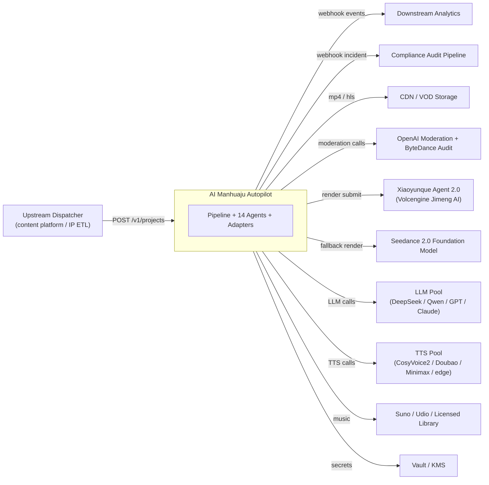

边界声明：

- **No human inside the dotted box.** 所有"人"都在系统之外（上游派单系统、下游分发系统、合规审计系统）。
- 调用方系统通过 REST API 提交 `ProjectInput` 即触发；系统通过 webhook 推送事件而不是被动等待人。
- 外部依赖均为软件 API；任何"队列等待人审"路径以软件熔断 + 自动改写 + 自动降级取代（REQ-RO-013）。

---

## 2. C4 — Container View

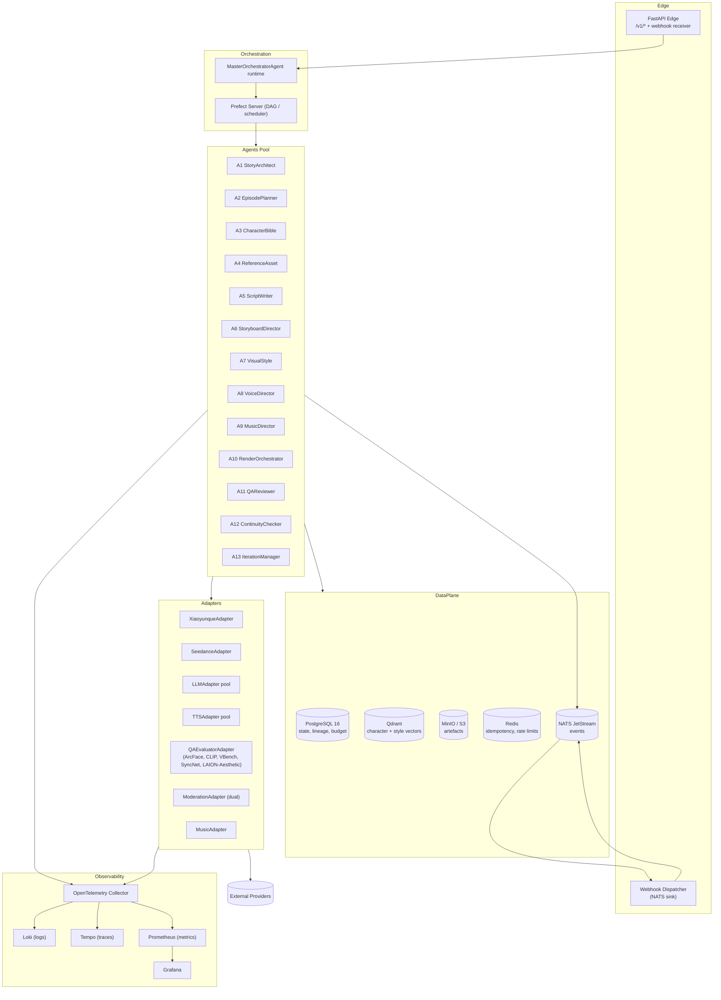

容器对应 REQ：

- API + Webhooks → REQ-IN-001/005/008, REQ-MO-010, REQ-EXT-001/005
- Prefect/MO → REQ-MO-001..010
- Agents Pool → §3
- Adapters → §8
- DataPlane → REQ-IN-002/012, REQ-NFR-PROV-***, REQ-NFR-REL-003
- Observability → REQ-NFR-OBS-***

---

## 3. C4 — Component View（按 Agent）

每个 Agent 内部沿用相同骨架（依赖倒挂安全）：

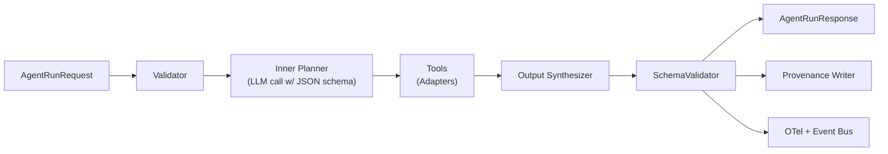

Agent 共享基础类骨架（pseudo）：

```python
class BaseAgent(Protocol):
    name: str
    version: str
    schemas_in: type[BaseModel]
    schemas_out: type[BaseModel]
    async def run(self, req: AgentRunRequest) -> AgentRunResponse: ...
```

下面给出 14 个 Agent 各自的"输入/输出/关键算法/失败处置/对应 REQ"摘要。

### 3.A1 StoryArchitectAgent
- 输入: `00_input/normalized.txt` + `manifest.json`
- 输出: `01_story_blueprint/blueprint.json`（StoryBlueprintSchema）
- 算法: long-context summarization + entity extraction + relation graph + timeline → schema-enforced LLM call (`response_format=json_schema`); LLM-Judge 三维评分 (faithfulness/coverage/structure)
- 失败处置: F-013 schema_violation → 切更强模型 → 降级 partial blueprint
- REQ: REQ-SA-001..012

### 3.A2 EpisodePlannerAgent
- 输入: blueprint + config(target episode count / target seconds)
- 输出: `02_episodes_plan/plan.json`
- 算法: beat-based episodic segmentation; cliffhanger scoring; budget allocation
- 失败处置: F-015 episode_count_autotune
- REQ: REQ-EP-001..010

### 3.A3 CharacterBibleAgent
- 输入: blueprint
- 输出: `03_character_bibles/{char_id}/bible.json`
- 算法: alias coreference (BGE-M3 + LLM)；trait extraction with span justification；state machine derivation
- 失败处置: F-008 conflict resolution (later-mention-wins-with-justification)
- REQ: REQ-CB-001..012

### 3.A4 ReferenceAssetAgent
- 输入: bible
- 输出: `03_character_bibles/{char_id}/refs/*.png`（≥8 视图）+ EXIF/XMP provenance
- 算法: 视图 plan → text-to-image (Seedance i2i) → ArcFace + CLIP intra-set 自检 → 失败重生（≤4 retries）→ 可选 LoRA
- 失败处置: F-002 regen_reference_assets, F-006 increase ref + reseed
- REQ: REQ-RA-001..010, REQ-CON-005..006

### 3.A5 ScriptWriterAgent
- 输入: episode plan + bible + style lock
- 输出: `04_scripts/ep{NN}.fountain` + `.json`
- 算法: scene plan → Fountain DSL → JSON twin (round-trip stable) → LLM Judge
- 失败处置: F-001/F-014/F-009 (moderation halt)
- REQ: REQ-SW-001..010

### 3.A6 StoryboardDirectorAgent
- 输入: script
- 输出: `05_storyboards/ep{NN}/*.json` + `thumbs/{shot_id}.png`（256×256 sanity）
- 算法: shot decomposition (≤2 chars per unit; 5/10/15s); thumbnail T2I sanity render; continuity score
- 失败处置: F-016 decompose group; F-007 lipfix routing later
- REQ: REQ-SD-001..009, REQ-CON-006

### 3.A7 VisualStyleAgent
- 输入: blueprint + config
- 输出: `style_lock.json` + project palette + per-location palette
- 算法: 选预设 → 锁定 → 派发到所有 prompt 之 `[STYLE_SHA]`
- 失败处置: F-005 if downstream aesthetic too low → param adjustment
- REQ: REQ-VS-001..006

### 3.A8 VoiceDirectorAgent
- 输入: script + bible
- 输出: `voice_assignments.json` + `07_audio/ep{NN}/dialogue/*.wav` + `*.lipsync.json`
- 算法: stable voice mapping; emotion-tagged TTS; UTMOS gating; consent guard
- 失败处置: F-008 utmos_low（再合成 / 切供应商）
- REQ: REQ-VD-001..006

### 3.A9 MusicDirectorAgent
- 输入: script + style lock + per-episode mood timeline
- 输出: `07_audio/ep{NN}/bgm.wav` + `mix.json` + `sfx/*`
- 算法: mood→cue mapping; ducking design; loudness compliance
- 失败处置: F-005 fallback to licensed library if generation fails
- REQ: REQ-MD-001..005

### 3.A10 RenderOrchestratorAgent
- 输入: storyboard + refs + style lock + voice (for sync hint)
- 输出: `06_renders/ep{NN}/shot_{NNN}.mp4` + `_metadata.json`
- 算法: per-shot Xiaoyunque submit + poll/webhook dual + idempotency cache + circuit breaker → fallback Seedance → degrade placeholder
- 失败处置: F-010/F-011/F-012/F-009
- REQ: REQ-RO-001..015

### 3.A11 QAReviewerAgent
- 输入: rendered shots + bible + script
- 输出: `09_qa_reports/ep{NN}/shot_{NNN}.json` + `episode.json`
- 算法: 三层 QA（technical / semantic / aesthetic）+ ArcFace/CLIP/VBench/SyncNet/LAION
- 失败处置: 路由到 IterationManager；硬红线（合规）走丢弃路径
- REQ: REQ-QA-001..008

### 3.A12 ContinuityCheckerAgent
- 输入: 已发布历史集 + 新集
- 输出: `09_qa_reports/cross_episode_matrix.json`
- 算法: 锚定帧池 (golden frames) + 跨集 ArcFace 矩阵 + drift detector
- 失败处置: F-017 preemptive_consistency_refresh
- REQ: REQ-CC-001..006, REQ-CON-***

### 3.A13 IterationManagerAgent
- 输入: any failed QA report
- 输出: `10_iterations/cycle_{NN}.json` + 修复任务回填到上游 Agent
- 算法: failure_mode → strategy decision table; budget enforcement; salvage policy
- 失败处置: 自身不允许失败 — fall back to `Failed_With_Salvage`
- REQ: REQ-IT-001..008

### 3.A0 MasterOrchestratorAgent
- 输入: ProjectInput
- 输出: 状态机推进；终态事件
- 算法: 三层状态机 (Project / Episode / Shot)；事件驱动；Budget 拦截器；checkpoint resume
- 失败处置: 任何下游 Agent 异常 → 对应失败模式映射；自身仅终结于 `Released | Failed_With_Salvage | Failed`
- REQ: REQ-MO-001..010

---

## 4. 14 Agent 拓扑与消息流

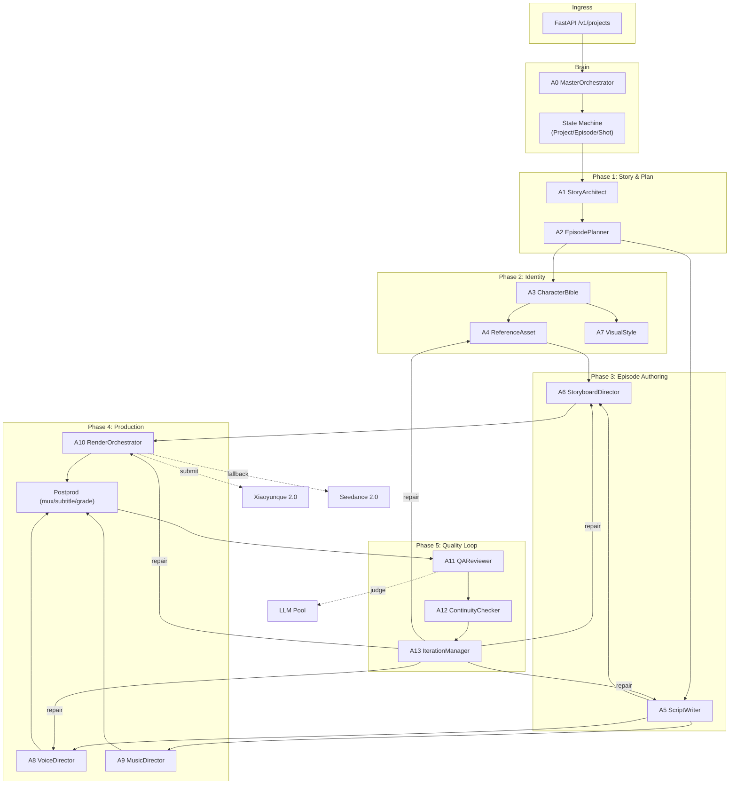

事件主题约定（核心摘要）：

| 事件 | 触发 | 关键 payload |
| --- | --- | --- |
| `manhuaju.event.project.accepted` | `POST /v1/projects` 成功 | `project_id, novel_sha, config_sha, seed` |
| `manhuaju.event.ingest.completed` | A0 触发后入库完成 | `chunks, total_chars` |
| `manhuaju.event.story_blueprint.completed` | A1 完成 | `blueprint_sha, judge_scores` |
| `manhuaju.event.episode_plan.completed` | A2 完成 | `episode_count, total_seconds, budget_split` |
| `manhuaju.event.character_bibles.completed` | A3 完成 | `roster_count, lead_count` |
| `manhuaju.event.reference_assets.ready` | A4 完成 | `asset_count, arc_face_intra, clip_intra` |
| `manhuaju.event.style.locked` | A7 完成 | `style_sha, palette` |
| `manhuaju.event.script.completed` | A5 完成 | `scene_count, shot_count` |
| `manhuaju.event.storyboard.completed` | A6 完成 | `shot_count, continuity_score` |
| `manhuaju.event.render.shot_completed` | A10 单镜头完成 | `shot_id, mp4_uri, credits` |
| `manhuaju.event.render.episode_completed` | A10 一集完成 | `success_count, degraded_count` |
| `manhuaju.event.qa.episode_passed/failed` | A11 完成 | `kpis, reasons[]` |
| `manhuaju.event.continuity.checked` | A12 完成 | `pass[], fail[]` |
| `manhuaju.event.iteration.completed` | A13 一次循环 | `cycle_id, strategy, kpi_delta` |
| `manhuaju.event.project.heartbeat` | 30s 周期 | `state, last_stage` |
| `manhuaju.event.project.completed/failed/failed_with_salvage` | 终态 | `final_kpis, cost, artefacts` |

---

## 5. 三层状态机（Project / Episode / Shot）

### 5.1 Project 状态机（顶层）

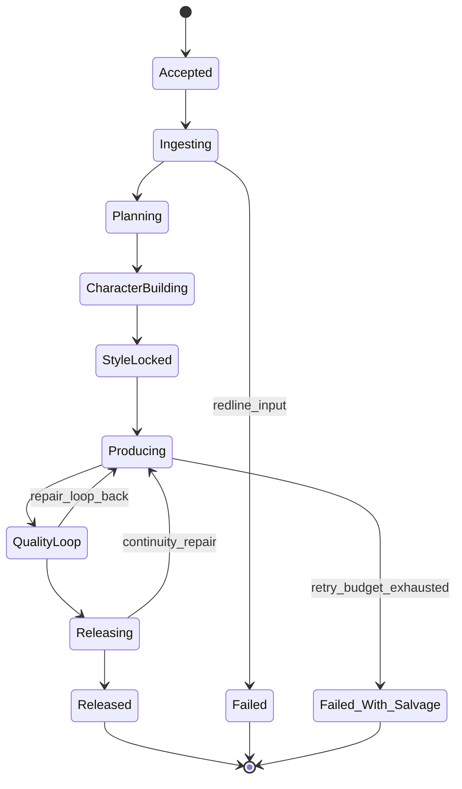

### 5.2 Episode 状态机

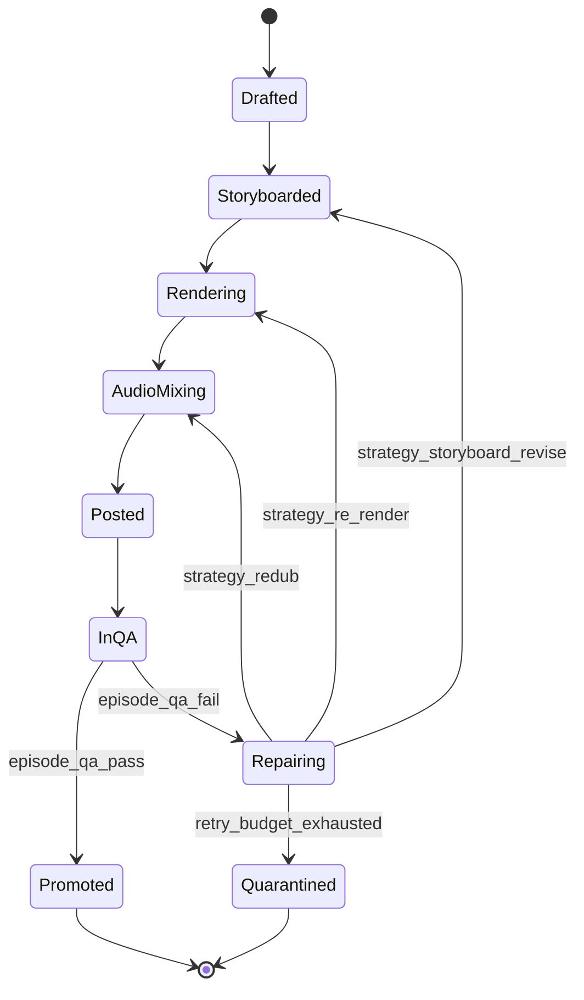

### 5.3 Shot 状态机

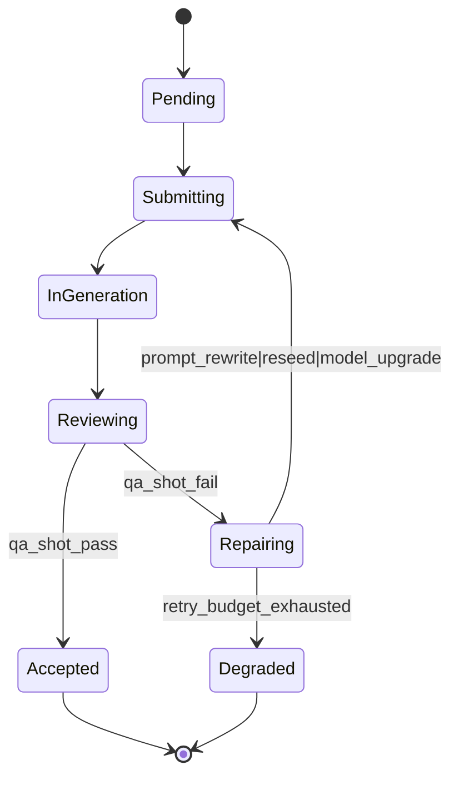

### 5.4 静态规则（结合 REQ-MO-008、REQ-IN-009、REQ-PILOT-011）

- 整图中**不存在**任何 `WaitForHumanApproval / ManualReview / OperatorAck / Pause(by-human)` 节点。
- `Pause` 仅由"调度器抢占"触发（REQ-MO-009），且"恢复"动作由资源释放事件自动触发。
- 失败终态 `Failed_With_Salvage` 仍输出可发布集（REQ-IT-008）。
- 状态变更必须由事件触发（REQ-MO-001/002）。

### 5.5 Checkpointing & 回放（REQ-MO-003/004）

- 每个状态变更原子写 `manhuaju_state_transitions(project_id, level, from, to, event_id, ts)`。
- 故障恢复：`MasterOrchestratorAgent` 启动时从 `state_journal.jsonl` 重放，找到最后稳定 checkpoint，重投未完成事件。

---

## 6. 数据模型 (pydantic v2 schemas)

> 本节定义产物 schema 的关键字段；详细字段表 + 校验规则随 Tasks 落到 `src/schemas/`。所有模型必须 `model_config = ConfigDict(extra="forbid", frozen=True)`，禁止隐式扩展。

### 6.1 项目级 (Project / Story / Episode / Character)

```python
class ProjectInput(BaseModel):
    project_id: UUID
    novel_uri: str
    novel_sha256: str
    config: ProjectConfig
    seed: int                           # P-3 强制
    submitted_at: datetime
    callback_urls: list[HttpUrl] = []   # 上游 webhook
```

```python
class ProjectConfig(BaseModel):
    style_preset_id: str                # see config/style-presets.yaml
    aspect_ratio: Literal["9:16","16:9","1:1"] = "9:16"
    resolution: Literal["1080p","2k"] = "1080p"
    fps: Literal[24,25,30] = 24
    target_locales: list[str] = ["zh-CN"]
    episode_count: int                  # planner may auto-tune ±10%
    target_seconds_per_ep: tuple[int,int] = (60, 180)
    consistency_tier: Literal["bible_only","lora"] = "bible_only"
    model_tier: Literal["fast","pro"] = "pro"
    budget_tier: Literal["S","M","L","XL"]   # maps to (max_tokens, max_seconds, max_credits)
    narration: bool = False
    mode: Literal["per_shot","express"] = "per_shot"
    redlines_profile_id: str = "default"
```

```python
class StoryBlueprint(BaseModel):
    blueprint_id: UUID
    blueprint_sha: str                  # canonical-JSON SHA-256
    world_rules: list[WorldRule]
    timeline: list[TimelineEvent]
    locations: list[Location]
    characters: list[CharacterStub]     # roster
    relations: CharacterGraph
    motifs: list[Motif]
    judge_scores: dict[str, float]      # faithfulness / coverage / structure
    provenance: BlueprintProvenance
```

```python
class CharacterBible(BaseModel):
    char_id: str
    bible_sha: str
    canonical_name: str
    aliases: list[str]
    screen_role: Literal["lead","support","cameo"]
    appearance: Appearance
    outfit_library: list[Outfit]        # default + signature + variants
    voice_profile: VoiceProfile
    personality: Personality
    state_machine: BibleStateMachine    # nodes/transitions w/ justifications
    relations: list[Relation]
    provenance: BibleProvenance
```

```python
class EpisodePlan(BaseModel):
    plan_id: UUID
    episodes: list[EpisodeBlueprint]
    budgets: BudgetAllocation           # reserve >= 5%
    judge_scores: dict[str,float]
```

```python
class EpisodeBlueprint(BaseModel):
    episode_id: str                     # ep01..epNN
    title: str
    synopsis_short: str                 # <= 80
    synopsis_long: str                  # <= 600
    target_seconds: int
    beats: list[Beat]                   # 6..14
    opening: OpeningHook
    closing: ClosingCliffhanger         # cliffhanger_strength 1..5
    characters_present: list[str]       # char_id
    locations_present: list[str]        # location_id
```

### 6.2 集级（Script / Storyboard / Style / Voice / Music / Render）

```python
class Script(BaseModel):
    episode_id: str
    fountain_uri: str                   # 04_scripts/epNN.fountain
    scenes: list[Scene]                 # each contains shots[]
    narration: list[NarrationLine] | None
    dialogue_localized: dict[str, list[DialogueLine]] | None
    timing: ScriptTiming                # cumulative_seconds within ±5%
    judge_scores: dict[str,float]
```

```python
class Storyboard(BaseModel):
    episode_id: str
    shots: list[StoryboardShot]
    continuity_score: float             # >= 0.9
```

```python
class StoryboardShot(BaseModel):
    shot_id: str                        # epNN_sNNN[_partK]
    scene_id: str
    sequence_index: int
    target_seconds: Literal[5,10,15]
    shot_size: Literal["ECU","CU","MS","WS","EWS"]
    camera_angle: Literal["eye","high","low","top","dutch"]
    camera_movement: Literal["static","pan","tilt","dolly","zoom","tracking","handheld"]
    lens_focal_mm: int
    depth_of_field: Literal["shallow","medium","deep"]
    lighting: LightingSpec
    palette_ref: list[str]
    weather: str
    characters: list[CharacterOnScreen] # length <= 2
    decomposition: GroupDecomposition | None
    blocking: list[BlockingNote]
    key_action: str
    key_emotion: str
    mood: str
    music_cue: str
    sfx_cue: str
    prompt_brief: PromptBrief           # >= 10 disjoint clauses
    parent_shot_id: str | None
    seq: int | None
```

```python
class StyleLock(BaseModel):
    style_sha: str
    preset_id: str
    aspect_ratio: str
    resolution: str
    fps: int
    duration_units: list[int] = [5,10,15]
    project_palette_hex: list[str]      # 8 master colors
    location_palette: dict[str, list[str]]
    locked_at: datetime
    immutable: bool = True
```

```python
class VoiceAssignmentBundle(BaseModel):
    project_id: UUID
    assignments: dict[str, VoiceProfile] # char_id -> voice
    pinned: bool = True
```

```python
class RenderJob(BaseModel):
    task_id: str                        # provider task id
    shot_id: str
    provider: Literal["xiaoyunque","seedance"]
    model_tier: Literal["fast","pro"]
    submitted_at: datetime
    status: Literal["pending","running","succeeded","failed","timeout","content_review_required"]
    prompt: str
    prompt_sha: str
    refs_image_uris: list[str]          # <= 9
    refs_video_uris: list[str]          # <= 3
    refs_audio_uris: list[str]          # <= 3
    seed: int
    request_payload_uri: str            # 99_provenance/render/{task_id}.json
    response_payload_uri: str | None
    output_mp4_uri: str | None
    metadata: RenderMetadata | None     # duration_s, fps, resolution, model_version, credits_spent
    retries: int = 0
    degraded: bool = False
```

### 6.3 QA / Continuity / Iteration

```python
class ShotQAReport(BaseModel):
    shot_id: str
    technical: TechnicalChecks          # codec, fps, resolution, watermark, text-artifact
    semantic: SemanticChecks            # llm-judge intent match, mood, characters present
    aesthetic: AestheticChecks          # laion mean / worst
    consistency: ConsistencyChecks      # arcface mean/worst, outfit clip
    sync: SyncChecks                    # syncnet offset
    moderation: ModerationCheck
    verdict: Literal["pass","fail"]
    reasons: list[str]
```

```python
class EpisodeQAReport(BaseModel):
    episode_id: str
    shots: list[str]
    pass_rate: float                    # >= 0.95
    aesthetic_mean: float               # >= 6.2
    arcface_mean: float                 # >= 0.92
    promoted: bool
    reasons: list[str]
```

```python
class ConsistencyMatrix(BaseModel):
    episodes_compared: list[str]
    matrix: dict[str, dict[str, dict[str,float]]]  # char_id -> ep_pair -> {arcface, outfit}
    drifted_chars: list[str]
    timestamp: datetime
    hash_chain_prev: str | None
    hash_chain_self: str
```

```python
class IterationCycle(BaseModel):
    cycle_id: str
    parent_target: Literal["shot","episode","project"]
    target_id: str
    failure_mode: str                   # F-XXX from catalog
    strategy: str                       # one of decision-table outputs
    before_metrics: dict[str,float]
    after_metrics: dict[str,float]
    delta: dict[str,float]
    cost_credits: float
    started_at: datetime
    finished_at: datetime
    outcome: Literal["fixed","not_improved","escalated"]
```

### 6.4 Provenance / Event / Budget

```python
class Provenance(BaseModel):
    artefact_uri: str
    sha256: str
    size: int
    producer_agent: str
    model: str
    model_version: str
    seed: int
    parent_artefact_uri: str | None
    prompt_sha256: str | None
    response_sha256: str | None
    created_at: datetime
    chain_prev_sha: str | None
    chain_self_sha: str
```

```python
class Event(BaseModel):
    event_id: UUID
    subject: str                        # manhuaju.event.<stage>.<status>
    project_id: UUID
    episode_id: str | None
    shot_id: str | None
    trace_id: str
    ts: datetime
    payload: dict
```

```python
class Budget(BaseModel):
    max_tokens: int
    max_seconds: int
    max_credits: int
    used_tokens: int = 0
    used_seconds: int = 0
    used_credits: int = 0
    reserved_credits: int               # >= 0.05 * max_credits
```

### 6.5 序列化与不变量

- 所有 schema 序列化使用 canonical JSON (`json_canonical_form`)，键序固定，浮点格式化固定。
- 所有 schema 含 `*_sha` 字段者，签出由 `canonical_json + utf-8 + sha256` 生成。
- 任意 `frozen=True`，写后不可变。

---

## 7. 关键时序图（4 张）

### 7.1 Sequence — 项目接入 → 分集大纲就绪

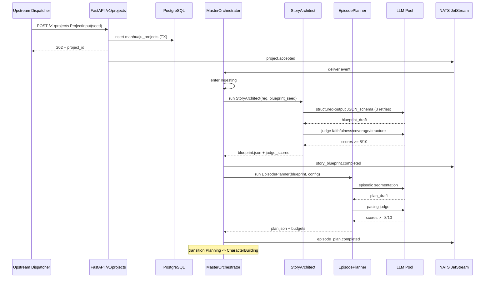

REQ 覆盖: REQ-IN-001..012, REQ-SA-001..012, REQ-EP-001..010, REQ-MO-001..007.

### 7.2 Sequence — 单集"剧本→分镜→渲染→QA→放行"

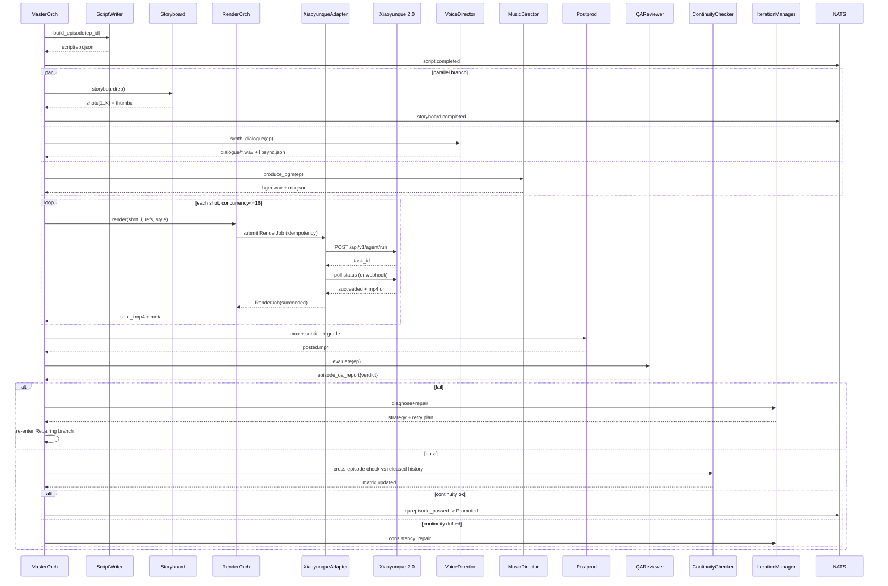

REQ 覆盖: REQ-SW/SD/RO/QA/CC/IT 全部 + REQ-MO-***.

### 7.3 Sequence — 跨集一致性校验与修复闭环

```mermaid
sequenceDiagram
    participant A12 as ContinuityChecker
    participant DB as PostgreSQL
    participant Q as Qdrant
    participant A13 as IterationManager
    participant A4 as ReferenceAsset
    participant A6 as Storyboard
    participant A10 as RenderOrch
    participant MO as MasterOrch
    A12->>DB: load anchor_frames per char_id
    A12->>Q: query top-k golden embeddings
    A12->>A12: compute cross-episode arcface matrix
    A12->>A12: detect drifted_chars[]
    alt no drift
      A12-->>MO: matrix updated, all green
    else drift detected
      A12->>A13: failure_mode=F-003 + drifted_chars + per-shot offending list
      A13->>A13: select strategy (consistency_refresh or lora_train if tier=lora)
      alt strategy=consistency_refresh
        A13->>A4: regen golden + signature outfits with constrained seed
        A4-->>A13: refs ready (intra-set arcface >= 0.94)
        A13->>A6: refresh storyboard prompts (inject new refs)
        A6-->>A13: storyboard updated
        A13->>A10: re-render offending shots only
        A10-->>A13: shots updated
        A13->>A12: re-evaluate matrix
        A12-->>A13: pass | still fail
      else strategy=lora_train
        A13->>A4: train LoRA(char_id) (tier=lora gate)
        A4-->>A13: lora artifact + A/B gain
        A13->>A10: re-render with lora preference
        A10-->>A13: shots updated
        A13->>A12: re-evaluate
      end
      alt fixed
        A13-->>MO: cycle outcome=fixed (kpi_delta>0)
      else not_improved
        A13->>A13: increment cycle; check budget
        alt budget exhausted
          A13-->>MO: escalate to project-level salvage
        else
          A13-->>MO: escalate (different strategy)
        end
      end
    end
```

REQ 覆盖: REQ-CON-***, REQ-CC-***, REQ-IT-001..008.

### 7.4 Sequence — 全链路降级（Xiaoyunque → Seedance Fast → 本地兜底）

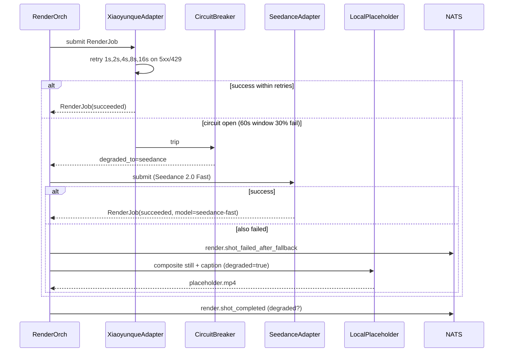

REQ 覆盖: REQ-RO-005/006/013, REQ-NFR-REL-002, REQ-IT-***.

---

## 8. 小云雀 / Seedance / 火山方舟 API 契约

### 8.1 Submit + Poll + Webhook 双通道

`XiaoyunqueAdapter` 抽象统一接口（详细字段表参见 `docs/architecture/api-contracts.md`，由 Tasks 落盘）：

```python
class RenderAdapter(Protocol):
    async def submit(self, job: RenderJob) -> str: ...                  # returns provider task_id
    async def poll(self, task_id: str) -> RenderStatusUpdate: ...
    async def cancel(self, task_id: str) -> None: ...
    async def fetch_result(self, task_id: str) -> RenderResult: ...

# Webhook receiver (FastAPI)
@app.post("/v1/webhooks/xiaoyunque")
async def webhook(req: Request) -> JSONResponse: ...
```

双通道策略（满足 REQ-RO-001/002/008/014/015）：

- **主**：异步 submit + 轮询 (interval = 5s, max wait = 300s)。
- **副**：webhook 推送 task_id 状态变更，写入同一 Redis key 加速完成感知。
- **去重**：Redis idempotency key = `sha256(prompt_sha|refs_sha|seed|model_tier)`；命中直接返回缓存结果。

### 8.2 多模态参考输入语义（≤9 图 / ≤3 视频 / ≤3 音频）

Seedance 2.0 Reference-to-Video 不使用标签语法（无 `@Image1`、`@Video1`），而是通过自然语言显式分配语义角色（与 `RA Render Prompt` 一致，REQ-RO-003）。本系统强制约定下述模板：

```
[STYLE_SHA: {style_sha}]
[SHOT_ID: {shot_id}]
Use image 1 as the first frame establishing the environment of {location}.
Match character "<{character.canonical_name}>" appearance to image 2 (front view) and image 3 (signature outfit close-up); keep the hair, accessories, and outfit identical to image 3.
Use image 4 as the most recent in-episode anchor of the same character for continuity.
The camera is {shot_size} {camera_angle} with {camera_movement}; lens {lens_focal_mm}mm; lighting {lighting.preset}.
Action: {key_action}. Emotion: {key_emotion}. Mood: {mood}.
Pacing constraints: keep duration {target_seconds}s.
Aspect ratio: {aspect_ratio}. Resolution: {resolution}. Style: {style_preset_id} ({style_dimensions}).
Do not place more than 2 named characters in frame.
Do not introduce text, watermarks, brand logos.
```

Lint 规则（REQ-RO-003）：禁止 `@token` 风格；禁止任何 `please / kindly`（弱化指令）；禁止"random"、"random-looking"等失控词。

### 8.3 风格枚举与映射

- `2d` → 卡通 / 漫画 / 国漫风（Xiaoyunque `style.2d`），适配大多数 IP 漫剧。
- `3d` → CG / 3D animation（Xiaoyunque `style.3d`）。
- `simhuman` → 仿真人（`style.simhuman`），适配真人短剧风格但合规需提升 (P-1) — 默认禁用，需 `config.simhuman_consent=true`。

### 8.4 Voice / Music 接口契约

- TTS：统一抽象 `TTSAdapter.synth(line, voice_profile, emotion, prosody) -> WavBytes + lipsync.json`。主供 CosyVoice 2 → 副 Doubao-TTS → 兜底 edge-tts；切换由熔断器统一驱动。
- Music：抽象 `MusicAdapter.compose(mood_timeline, style_key) -> WavBytes + license_meta`。主 Suno → 副 Udio → 兜底本地正版库。

---

## 9. 一致性引擎 (Consistency Engine) 专章

### 9.1 角色 ID 抽取

- **第一阶段 (entity)**：`StoryArchitectAgent` 用 LLM 抽取所有命名实体；通过 `BGE-M3` 嵌入做近似聚类得到候选 `char_id_candidate`；再用 LLM 二次确认 alias→canonical 映射。
- **第二阶段 (visual fingerprint)**：`ReferenceAssetAgent` 生成 ≥8 张多视图后，提取 ArcFace embedding & CLIP outfit 多标签 → 写入 Qdrant `manhuaju_chars` 集合，键 `(project_id, char_id)`。
- **第三阶段 (temporal anchor)**：每集渲染后，从 5%/50%/95% 帧取样，更新 "golden frame pool" — 仅 `BibleStateMachine` 允许的 transition 才能更新对应 outfit 的金本帧。

### 9.2 跨集锚定算法

```text
Input:  episode_index n, character c, episodes_released [1..n-1]
1) Sample 8 frames per shot in episode n where c is on-screen
2) Compute arcface_embedding (face) + clip_outfit_multilabel (body)
3) For each prior episode m in [1..n-1]:
     get golden_set(c, outfit_active_at_m)
     score_m = mean cosine(em, frame_embeddings)
4) score_cross = weighted_mean(score_m, w = recency_decay)
5) Persist consistency_matrix[c][n][m] = (arcface=score_m, outfit=clip_match_m)
6) If score_cross < threshold(c.role): mark drift; emit F-003
```

### 9.3 状态机：合法转移

`BibleStateMachine` 节点 = `(age_band, hair_state, wound_state, outfit_id)`；转移合法性由源小说 `beat_id` 提供 justification (REQ-CB-004)。Continuity 模块对每集前后 outfit 切换做规则核验：

- 同一集内 outfit 切换需要 `scene_transition` 标志或 `costume_change` beat。
- 跨集 outfit 切换需要 bible state machine 上存在合法 edge；否则计 `F-004 outfit_mismatch`。
- 头发颜色变化需要 `dyed_at_beat_id`；伤痕变化需要 `wounded_at_beat_id`/`healed_at_beat_id`。

### 9.4 LoRA 训练（可选 tier）

- 数据集：8 视图 ×4 增强 = 32 张，外加 8 张关键帧裁切。
- 训练脚本：`SD-LoRA` 默认参数；max steps=2000；rank=16；batch=2；lr=1e-4。
- 评估：A/B vs 仅 bible 路径，要求 +ArcFace ≥ 0.02；不达标则 fallback。
- 持久化：`03_character_bibles/{char_id}/lora/model.safetensors` + provenance。

### 9.5 漂移监测（drift detector）

- 输入：连续 3 集的 arcface_mean。
- 规则：mean 单调下降且降幅 ≥ 0.02/集 → 提前触发 `consistency_refresh`（REQ-CON-009）。

---

## 10. 错误处理 / 降级矩阵

### 10.1 横切策略

- 所有外部调用强制走 `ResilientCall(retry, timeout, breaker, budget_check)`：
  - retry：指数退避 1→16s，最大 5 次；幂等性 key 强制。
  - timeout：每调用上限 90s（render 例外 600s）；超时按 `5xx` 处理。
  - breaker：Hystrix 风格，60s 滑窗 30% 失败即开断。
  - budget_check：单次调用先评估剩余预算，若不足则跳过到降级。

### 10.2 矩阵（节选；全表见 `docs/architecture/failure-matrix.md` 由 Tasks 落盘）

| 依赖 | 失败码 / 现象 | 一级处置 | 二级处置 | 红线 / 终态 | 关联 REQ | 关联 Failure Mode |
| --- | --- | --- | --- | --- | --- | --- |
| Xiaoyunque API | `429 RateLimit` | 退避重试 5× | 切 Seedance Fast | — | REQ-RO-005, REQ-NFR-PERF-002 | F-011 |
| Xiaoyunque API | `5xx` / 超时 | 退避重试 | 熔断切 Seedance | 二级也失败 → 占位降级 | REQ-RO-005/006 | F-010 |
| Xiaoyunque API | `content_review_required` | Prompt 自动改写 ×2 | 路由 IT，必要时整集废弃 | Moderation 红线触发即整集废弃 | REQ-RO-013, REQ-NFR-SEC-002 | F-009 |
| Seedance 2.0 | 任意失败 | 重试 ×3 | 占位降级 | — | REQ-RO-006 | F-010 |
| LLM 主供应商 | timeout / 5xx | 切次供应商 | 切第三供应商 + 缩短上下文 | 三家全 fail → degraded | REQ-NFR-REL-001 | F-013/F-014 |
| TTS 主路径 | 5xx | 重试 ×3 | 切 Doubao-TTS | 切 edge-tts；最终降级 caption-only | REQ-VD-004 | F-008 |
| Music | 生成失败 | 重试 ×2 | 切本地正版库 | 仍失败 → silent BGM | REQ-MD-001 | — |
| Moderation | hit | 整集废弃 | 写 incident | **零容忍** | REQ-NFR-SEC-002/004 | F-009 |
| QA Gate (consistency) | < 阈值 | IT cycle (refresh) | 提升 model_tier | escalate to project salvage | REQ-CON-***, REQ-IT-001..008 | F-003 |
| QA Gate (aesthetic) | < 阈值 | rewrite_prompt | upgrade tier | placeholder | REQ-QA-001 | F-005 |
| QA Gate (sync) | offset>2 | lipfix MuseTalk | retts | placeholder + caption | REQ-QA-008, REQ-VD-006 | F-007 |
| Budget | 即将超 | model_tier=fast | 砍掉 reserve | 终止任务 | REQ-NFR-COST-001..003 | F-012 |
| 输入合规 | redline | reject @ ingest | — | hard fail | REQ-NFR-SEC-003 | F-020 |
| 上传文件 | mime mismatch | reject @ ingest | — | hard fail | REQ-IN-007 | F-019 |

### 10.3 IterationManager 决策表（摘要）

```text
failure_mode -> strategy -> stage_target
F-001 prompt_too_long          -> rewrite_prompt              -> shot
F-002 reference_image_missing  -> regen_reference_assets      -> char/refs
F-003 consistency_face_low     -> consistency_refresh         -> char/refs+shot
F-004 outfit_mismatch          -> regen_outfit + prompt_fix   -> char/refs+shot
F-005 aesthetic_low            -> upgrade_tier or rewrite     -> shot
F-006 vbench_subject_low       -> increase_refs + reseed      -> shot
F-007 syncnet_offset_high      -> lipfix_pass                 -> shot
F-008 utmos_low                -> regen_tts                   -> dialogue
F-010 api_5xx / fallback_fail  -> degrade_placeholder         -> shot
F-013/F-014 schema_violation   -> stronger_llm + structured   -> agent
F-015 duration_overrun         -> rewrite_storyboard          -> ep/storyboard
F-016 group_scene_too_many     -> decompose                   -> ep/storyboard
F-017 drift_episode_trend      -> preemptive_refresh          -> char
F-018/F-019/F-020 hard_fail    -> terminate / quarantine      -> project
```

### 10.4 重试预算

- 镜头层：`shot_retry_budget = 3`（与 REQ-IT-002 一致）
- 集层：`episode_retry_budget = 2`
- 项目层：`project_retry_budget = 1`（仅 consistency 抢救）
- 任一耗尽：升一层；最终升到项目层耗尽 → `Failed_With_Salvage`。

---

## 11. 可观测设计 (Observability)

### 11.1 三位一体

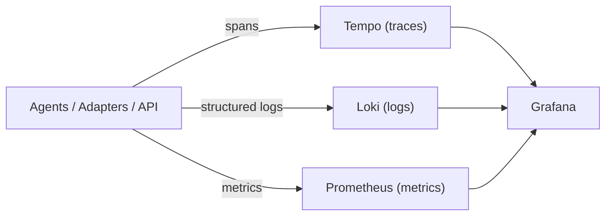

### 11.2 Trace 三层

- L1 `project` span：`POST /v1/projects` 进入直至终态事件结束。
- L2 `stage` span：每个 Agent 的一次 `run()` 调用。
- L3 `tool` span：每个 Adapter 调用（render / LLM / TTS / QA evaluator）。

每个 span 的强制属性：`project_id, episode_id?, shot_id?, agent, adapter, model, tokens, credits, latency_ms, retries, degraded`（REQ-NFR-OBS-001）。

### 11.3 指标 (Prometheus)

| 名称 | 类型 | 标签 | 含义 |
| --- | --- | --- | --- |
| `manhuaju_episode_latency_seconds` | histogram | `tier, locale` | 单集端到端时延 |
| `manhuaju_shot_render_latency_seconds` | histogram | `provider, tier` | 单镜头渲染时延 |
| `manhuaju_arcface_cross_episode` | gauge | `project_id, char_id` | 跨集 ArcFace mean |
| `manhuaju_aesthetic_mean` | gauge | `project_id, episode_id` | 美学分均值 |
| `manhuaju_cost_rate_credits_per_sec` | gauge | `project_id` | 实时燃烧率 |
| `manhuaju_failure_total` | counter | `failure_mode` | 失败模式累计 |
| `manhuaju_iteration_total` | counter | `strategy, outcome` | 迭代修复事件 |
| `manhuaju_circuit_state` | gauge | `provider` | 熔断状态 |
| `manhuaju_provider_5xx_total` | counter | `provider` | 上游 5xx |
| `manhuaju_moderation_hits_total` | counter | `provider, layer` | 合规命中 |

### 11.4 Dashboards

强制 6 块（REQ-NFR-OBS-004）：

1. **Project Lifecycle**：每项目所处状态 + 用时漏斗。
2. **Agent Latency**：14 个 Agent 的 P50/P95/P99。
3. **Cost**：燃烧率 / 累计 / 预测耗尽 ETA。
4. **Consistency**：跨集 ArcFace / OutfitMatch 热力图。
5. **Quality Gates**：通过率 / 失败模式 Top-N。
6. **Errors & Degradation**：5xx / 429 / 熔断状态 / 降级路径调用次数。

### 11.5 Provenance Store

- 介质：MinIO `manhuaju-{env}-provenance` + Postgres `manhuaju_provenance`。
- 写一次（append-only）+ 哈希链（`chain_prev_sha → chain_self_sha`）保证不可篡改 (REQ-NFR-PROV-003)。
- 每次 Agent / Adapter 调用都写 `Provenance` 记录；合规审计可全链路重放。

---

## 12. 安全 / 合规

### 12.1 密钥与机密

- 全部第三方 key 由 Vault 注入；进程内**不可**写入磁盘 / 环境变量长期保存（REQ-NFR-SEC-001）。
- 启动时 `secrets_loader` 校验：缺失 / 明文 → 拒启动。
- 敏感日志上线前截断 + 哈希引用（REQ-NFR-OBS-003）。

### 12.2 双层 Moderation

- 输入合规（REQ-NFR-SEC-003）：拦截"真人未授权肖像 / NSFW Tier-A+ / 涉政涉宗教 / 未成年敏感"。
- 输出合规（REQ-NFR-SEC-002/004）：每帧关键帧 (1fps 抽样) + 每条台词 + 每段 BGM 歌词，OpenAI Moderation **AND** 字节内容审核。
- AND 逻辑：任一 hit 即整集废弃 + Incident（零误放）。

### 12.3 PII 与著作权

- PII 检测：Regex + ML (presidio) → 日志/产物匿名化 (REQ-NFR-SEC-005)。
- 著作权：Music license metadata 写入 `provenance.license`，无 license 不发布。

### 12.4 静态/运行时安全

- `bandit` + `semgrep` CI 卡口；高危规则 zero-tolerance。
- 容器使用最小 base image (`python:3.11-slim`) + non-root；只读根文件系统；secrets 仅作为 in-memory mount。
- Network policy：Agents Pool 仅可访问声明白名单；外网出口集中在 egress proxy。

### 12.5 输入输出红线

- `config/redlines.yaml` 定义类目；`RedlineProfile` schema 编译为运行期检查。
- `Failed` 终态时仍写完整 incident provenance（便于审计）。

---

## 13. 成本模型 + Budget 闭环

### 13.1 Budget 三元组

`Budget = (max_tokens, max_seconds, max_credits)`：

- `max_tokens`：LLM 总 token 预算；每个 Agent 调用按返回的 usage.token 计费。
- `max_seconds`：流水线累计 wall-clock；Prefect/MO 周期检查。
- `max_credits`：Xiaoyunque/Seedance/TTS/Music 折算的统一信用值（参见 `config/cost.yaml`）。

`budget_tier ∈ {S,M,L,XL}` 映射默认上限：

| Tier | max_tokens | max_seconds | max_credits | 单集成本目标 |
| --- | --- | --- | --- | --- |
| S | 5M | 4h | 6,000 | ≤ ¥40 |
| M | 12M | 8h | 12,000 | ≤ ¥80 (默认) |
| L | 24M | 12h | 24,000 | ≤ ¥150 |
| XL | 48M | 24h | 48,000 | ≤ ¥250 |

### 13.2 闭环

- 每个 Agent / Adapter 调用前向 `BudgetService.check(scope)` 申请预算份额；通过则记录 `reservation`，失败则触发降级或终止。
- 调用后 `BudgetService.charge(actual)` 写实际消耗；`reservation - actual` 释放。
- `BudgetService.predict()` 用滑动平均 + 剩余镜头数预测耗尽 ETA；ETA < 阈值 → 触发降级（REQ-NFR-COST-003）。

### 13.3 成本归因

- 每条 `Provenance` 记录 `cost_credits` + 折算 `cost_rmb`（基于 `config/cost.yaml`）。
- 项目终态事件携带成本拆分：`{render, llm, tts, music, qa, total}`。

---

## 14. 部署拓扑

### 14.1 Reference Cluster

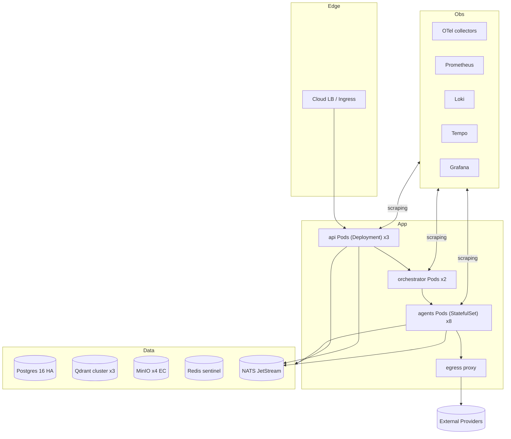

### 14.2 资源预算（默认）

- API: 3 Pods × 2 vCPU / 2 GiB
- Agents: 8 Pods × 4 vCPU / 8 GiB（Render-bound 等待为主，可弹性）
- Orchestrator: 2 Pods × 2 vCPU / 4 GiB
- Postgres HA: 3 节点 × 4 vCPU / 16 GiB / 500 GB SSD
- Qdrant: 3 节点 × 4 vCPU / 16 GiB / 200 GB SSD
- MinIO: 4 节点 × 4 vCPU / 16 GiB / 4 TB
- 单 K8s 集群可承载 ≥ 8 集/小时（REQ-NFR-PERF-003）

### 14.3 IaC

- Pulumi (Python) 项目 `ops/pulumi/`：cluster + namespace + helm release + secrets.
- Helm Charts 在 `ops/helm/manhuaju/`：values 文件按环境 `(dev, staging, prod)`。
- CI/CD：GitHub Actions 矩阵（lint / type / unit / e2e-mock / image-scan / sign / push / argocd-sync）。

---

## 15. 反向追踪总矩阵 (Design ↔ Requirements)

| Design 章节 | 主要 REQ 群 | 备注 |
| --- | --- | --- |
| §1 System Context | REQ-IN-001/005, REQ-MO-010, REQ-EXT-001/005 | API + 调用方关系 |
| §2 Container View | REQ-NFR-OBS-***, REQ-NFR-REL-002/003 | 容器与可观测/可靠性 |
| §3 Component View | REQ-SA / EP / CB / RA / SW / SD / VS / VD / MD / RO / QA / CC / IT / MO 全部 | 14 Agent |
| §4 拓扑 / 消息 | REQ-MO-001/006, REQ-NFR-OBS-002 | 事件总线 |
| §5 状态机 | REQ-MO-001..010, REQ-IN-009, REQ-PILOT-011, REQ-MO-008 | 三层状态机 + 无人工节点 |
| §6 数据模型 | 全部产物 schema | 与 P-7 Provenance 同步 |
| §7 时序图 | REQ-IN/SA/EP/SW/SD/RO/QA/CC/IT/CON/RO 全链 | 4 张关键时序 |
| §8 API 契约 | REQ-RO-001..015, REQ-CON-006 | 小云雀 / Seedance |
| §9 一致性引擎 | REQ-CON-001..010, REQ-CC-001..006, REQ-CB-004 | 头号 KPI |
| §10 错误/降级 | REQ-IT-001..008, REQ-RO-005/006/013, REQ-VD-004, REQ-NFR-REL-*** | F-### → strategy |
| §11 可观测 | REQ-NFR-OBS-***, REQ-NFR-PROV-***, REQ-MO-002/003 | trace/log/metric |
| §12 安全合规 | REQ-NFR-SEC-***, REQ-RA-010, REQ-VD-005 | 双层 moderation |
| §13 成本 | REQ-NFR-COST-***, REQ-IN-010, REQ-MO-005, REQ-RO-009 | budget tier |
| §14 部署 | REQ-NFR-PERF-003, REQ-NFR-REL-002/003 | reference cluster |
| §17 ADR | 横切 | 12+ 决策 |

---

## 16. 风险登记 + 缓解措施

| 编号 | 风险 | 概率 | 影响 | 缓解 |
| --- | --- | --- | --- | --- |
| R-01 | 小云雀 API 限流 / 排队不可控 | 高 | 高 | 双轨（Seedance Fast 兜底）+ 熔断 + 占位降级 |
| R-02 | 跨集人物漂移在长篇集数（>30 集）累计 | 高 | 高 | drift detector 提前 + LoRA tier + golden frames anchor + bible state machine |
| R-03 | LLM 输出幻觉违反 schema | 中 | 中 | 强制 `response_format=json_schema` + 结构化重试 + 三供应商热切 |
| R-04 | 合规误判（false-positive 或 false-negative） | 中 | 高 | 双层 moderation AND；定期回归集 + redline tuning |
| R-05 | TTS 唇音不同步 | 中 | 中 | SyncNet gate + MuseTalk lipfix |
| R-06 | 项目预算实际超支 | 中 | 中 | budget service + 自动降级 + 预测 ETA |
| R-07 | 状态机由于代码缺陷出现死锁 | 低 | 高 | 静态分析 + 可视化 + checkpoint resume + chaos test |
| R-08 | 训练/推理资源不足导致延迟违约 | 中 | 中 | HPA + spot pool + tier downgrade |
| R-09 | 真实小说含敏感内容混杂 | 中 | 高 | 输入 redline 拦截 + 整段隔离 + 显式 incident |
| R-10 | LoRA 训练抖动 / 收敛失败 | 中 | 中 | A/B fallback；不达标自动回退到 bible_only |
| R-11 | Provenance 链断裂 | 低 | 高 | Hash chain + 周期完整性扫描 |
| R-12 | 多语言翻译质量差 | 中 | 中 | 回译 BLEU 阈值 + 二级供应商 |

---

## 17. ADR (Architecture Decision Records) — 共 14 条

> 每条 ADR 仅给关键摘要；展开版随 Tasks 落到 `docs/architecture/adr/ADR-###-*.md`。

### ADR-001 选择 Xiaoyunque Agent 2.0 + Seedance 2.0 双轨而非单一 Sora 2
- **Decision**: 主 Xiaoyunque 2.0 + 兜底 Seedance Fast。
- **Rationale**: Xiaoyunque 拥有项目级角色档案 + 中文合规 + 短剧 Agent 长篇直出，Seedance 提供底层兜底；Sora 2 不支持真人 + Character Cameo API 不稳定；两轨更鲁棒。
- **Consequences**: Adapter 双实现；Prompt natural-language 多模态指派；REQ-RO-001..006 直接对应。

### ADR-002 状态机与 Pipeline 分离（Prefect + MO）
- **Decision**: Prefect 负责 DAG 调度；MO 负责业务状态机；Prefect 不感知业务状态。
- **Rationale**: 业务状态机演化频繁，DAG 编排稳定；解耦后可单独演进。
- **Consequences**: 双心智模型；通过事件桥接（NATS）。

### ADR-003 一致性主指标采用 ArcFace + CLIP，而非纯 LLM-Judge
- **Decision**: 头号 KPI 采用客观度量（ArcFace cos + CLIP 多标签 + VBench Subject Consistency）。
- **Rationale**: 满足 P-3 可复现 + 可机器判定；LLM Judge 仅作为辅助 (faithfulness/coverage)。
- **Consequences**: 引入 InsightFace + open_clip + VBench 三个评估器（QAEvaluatorAdapter）。

### ADR-004 EARS 强制 + AC 可机器判定
- **Decision**: 所有 REQ 必带 AC（数值 / 正则 / 断言 / 事件存在性）。
- **Rationale**: 与 P-2 / P-4 一致，使 spec → code → test 可机械化。
- **Consequences**: SpecReviewAgent 卡口；非机器可判定的 AC 在 CI 阶段拒绝合并。

### ADR-005 不引入 LoRA 训练为 MVP
- **Decision**: MVP 走 `consistency_tier=bible_only`；LoRA 作为 v2 / 大客户 tier。
- **Rationale**: 项目级档案 + 多视图参考 + 锚定帧池已可达 ≥ 0.92；LoRA 训练成本/时延高；REQ-CON-008 留旁路。
- **Consequences**: tier 配置；A/B harness 必须实现以备 v2 平滑切换。

### ADR-006 IterationManager 用决策表而非贪心重试
- **Decision**: failure_mode → strategy 是显式表 (closed enum)。
- **Rationale**: P-1 / P-4 — 行为可预测、可静态校验；避免无意义循环重试。
- **Consequences**: F-### catalog 是宪法级文档；新增 failure mode 必须改决策表 + 回归测试。

### ADR-007 Prompt 全部用自然语言多模态指派，禁 `@token`
- **Decision**: Render Prompt 不使用 `@CharacterID` 标签，改用"image i 用作首帧 / 匹配 image j 的发型"等表达。
- **Rationale**: Seedance 2.0 / Xiaoyunque 2.0 的多模态语义即是自然语言；Sora 2 风格 `@token` 在我们的渲染路径不可移植。
- **Consequences**: Prompt linter 强制；REQ-RO-003 测试覆盖。

### ADR-008 双 Moderation = AND 逻辑
- **Decision**: OpenAI Moderation 与字节审核并联，AND 通过才放行。
- **Rationale**: P-1 零容忍；中外双口径；优先误杀而非误放。
- **Consequences**: 召回率优先；可能造成轻微误杀，由 Iteration 自动改写救回大部分。

### ADR-009 Determinism 默认开启
- **Decision**: 所有 LLM/Diffusion 调用必带 seed；不带 seed 的 schema 拒启动。
- **Rationale**: P-3 + Pilot REQ-PILOT-010；可复现产线生命线。
- **Consequences**: 模型温度受限；Adapter 必须暴露 seed pass-through。

### ADR-010 全程 Budget Service 强制
- **Decision**: 所有外部调用必走 BudgetService 拦截。
- **Rationale**: P-6；防呆失控。
- **Consequences**: 任何旁路调用属于违规，CI 静态检查阻断。

### ADR-011 Schema-First, frozen=True
- **Decision**: 所有产物 schema `extra=forbid` + `frozen=True`。
- **Rationale**: P-2 / P-7；防 schema 漂移。
- **Consequences**: 升级 schema 必须迁移；migrations/ 目录维护。

### ADR-012 选 NATS JetStream 而非 Kafka
- **Decision**: 事件总线用 NATS JetStream。
- **Rationale**: 单数据中心场景轻量级 + 持久化；无需 Kafka 全套基建；Subject 命名贴合事件总线模型。
- **Consequences**: 跨数据中心或巨型吞吐场景 v2 评估替换 Kafka/Pulsar。

### ADR-013 仿真人风格默认禁用
- **Decision**: `style=simhuman` 默认禁用，需 `simhuman_consent=true` 才允许。
- **Rationale**: P-1 红线 + 真人合规风险。
- **Consequences**: API 校验；输入若含真人参考默认拒。

### ADR-014 Failure_With_Salvage 终态优先于 Failed
- **Decision**: 项目级失败优先尝试"可发布的子集 + 隔离失败的子集"。
- **Rationale**: 业务损失最小化；降级合规。
- **Consequences**: salvage 路径必须实现 + 覆盖测试。

---

## 18. 自验证清单 (Design Self-Check)

- [x] 每章对应至少一组 REQ-ID（§15）
- [x] 14 个 Agent 在 §3 + §4 完整出现
- [x] 状态机不存在任何 `WaitFor / Manual` 节点（§5）
- [x] 4 张时序图覆盖（接入、生产、跨集修复、降级）（§7）
- [x] API 契约明确禁 `@token` 风格（§8.2）
- [x] 一致性 KPI 与 §9 算法一致（ArcFace ≥ 0.92 / CLIP ≥ 0.95）
- [x] 错误降级矩阵覆盖所有外部依赖（§10）
- [x] 可观测三件套 + 6 块 Dashboard（§11）
- [x] 双层 Moderation AND 显式（§12.2）
- [x] Budget 三元组 + 闭环（§13）
- [x] ≥ 12 条 ADR（§17 共 14 条）
- [x] 风险登记 ≥ 10 条（§16 共 12 条）

---

> 至此 Phase 2 完成。下一阶段：[`tasks.md`](./tasks.md)。
