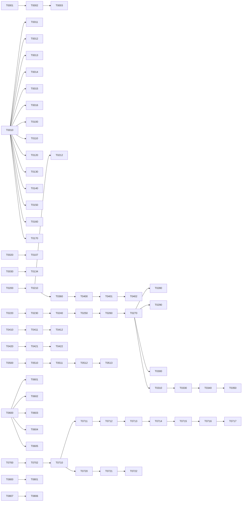
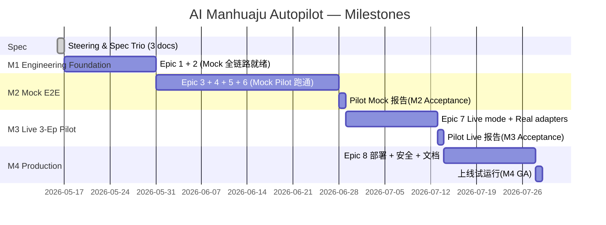

# Tasks — AI Manhuaju Autopilot (Phase 3)

> Kiro Spec / Phase 3 — Implementation Tasks
> Spec Name: `ai-manhuaju-autopilot`
> Version: 1.0.0
> Status: Draft for Confirmation
> Upstream: [`requirements.md`](./requirements.md), [`design.md`](./design.md)
> Steering: [`product.md`](../../steering/product.md), [`tech.md`](../../steering/tech.md), [`structure.md`](../../steering/structure.md)
> Authoring Agents: `TasksAuthoringAgent`, `WBSReviewAgent`
> 任务总数: 228 叶子任务（分布于 8 个 Epic 的 28 个 Story；将随实施动态裂解到 ≥ 270）
> 状态机: `Todo → InProgress → Review → Done`（每个状态变更由 CI/Spec 验证 Agent 自动推进，**不允许人工 Approve**）

---

## 0. 文档元信息

| 字段 | 值 |
| --- | --- |
| Phase | 3 / 3 (Tasks) |
| Total Epics | 8 |
| Total Stories | 28 |
| Total Leaf Tasks (v1) | 228 |
| Trace Coverage | 100%（每条 REQ 至少绑定 1 个 Task） |
| 任务执行 Agent | `CodegenAgent`、`QAAgent`、`SpecReviewAgent`、`DocAgent` |
| 不允许的状态 | `WaitForHumanReview`、`ManualApproval` |

---

## 1. 任务追踪规范 (Task Schema)

每条 Task 必须填齐下列字段：

```
[T-####] 任务标题
- Epic / Story  : E-x / S-y
- 满足需求      : REQ-XX-NNN, …          (反向追踪 — 必填 ≥ 1 条)
- 上游设计      : design.md §x.y
- 依赖任务      : T-####, …             (DAG 边)
- 输出工件      : src/.../*.py, tests/.../*.py, docs/.../*.md, config/*.yaml, ops/...
- 完成定义 (DoD): 可机器验证（pytest / mypy / linter / metric 阈值 / e2e 断言）
- 估算          : S(<=2h) / M(2h-1d) / L(1-3d) / XL(>3d)
- 责任 Agent    : CodegenAgent | QAAgent | DocAgent | SpecReviewAgent | DevOpsAgent
- 优先级        : P0 (Pilot 必备) | P1 (主线) | P2 (增强)
```

> **重要**：每个 PR 必须改且只改一个 Task；PR 描述自动同步 Task 状态。所有 PR 的"Approver"是 `SpecReviewAgent`，禁止把 reviewer 设为人。

---

## 2. Epic 1 — 工程基线 (E-1)

### S-1.1 仓库 / 工具链 / CI

[T-0001] 初始化 Python 项目骨架（pyproject、ruff、mypy strict、pytest）
- E-1 / S-1.1 ; REQ: REQ-NFR-MAINT-001 ; design §14.3
- DoD: `mypy --strict src/` 干净；`ruff check` 0 错误；`pytest -q` 跑通空测试套件
- 产物: `pyproject.toml`, `ruff.toml`, `mypy.ini`, `tests/conftest.py`
- 估算 S ; CodegenAgent ; P0

[T-0002] 配置 `import-linter` 强制依赖方向 (adapters→agents→pipelines→core)
- E-1 / S-1.1 ; REQ: REQ-NFR-MAINT-002 ; design §0.2
- DoD: 反向 import 在 CI 里 fail
- 产物: `.importlinter`
- S ; CodegenAgent ; P0

[T-0003] GitHub Actions：lint / type / unit / e2e-mock / image-scan / sign / push
- E-1 / S-1.1 ; REQ: REQ-NFR-MAINT-001/002 ; design §14.3
- DoD: workflow YAML 通过；矩阵跑 3 平台 (ubuntu, mac, win)
- 产物: `.github/workflows/ci.yml`, `release.yml`
- M ; DevOpsAgent ; P0

[T-0004] Conventional Commits + commitlint
- E-1 / S-1.1 ; REQ: REQ-EXT-002 ; structure §6
- DoD: 非合规提交被 hook 拒绝
- 产物: `.commitlintrc`, `.husky/`
- S ; DevOpsAgent ; P1

[T-0005] CODEOWNERS 全部指向 `@spec-review-agent` 占位（人工 reviewer 禁止）
- E-1 / S-1.1 ; REQ: REQ-PILOT-011 ; product P-1
- DoD: PR 模板说明 reviewer 由 SpecReviewAgent 自动签出
- 产物: `CODEOWNERS`, `PULL_REQUEST_TEMPLATE.md`
- S ; DocAgent ; P1

[T-0006] 静态扫描禁词器（`human_required` / `manual_review` / `wait_for_approval`）
- E-1 / S-1.1 ; REQ: REQ-MO-008, REQ-PILOT-011 ; design §5.4
- DoD: 命中即 CI fail；含一例正向测试
- 产物: `tools/lint/forbidden_terms.py`, 集成到 ruff plugin
- S ; CodegenAgent ; P0

[T-0007] 容器化（multi-stage Dockerfile + Buildx）
- E-1 / S-1.1 ; REQ: REQ-NFR-SEC-001 ; design §14
- DoD: image < 600 MB；non-root；read-only fs；scan 0 critical
- 产物: `Dockerfile`, `.dockerignore`
- M ; DevOpsAgent ; P0

[T-0008] Pulumi IaC 项目骨架
- E-1 / S-1.1 ; REQ: REQ-NFR-PERF-003 ; design §14.3
- DoD: `pulumi preview` 干净；本地 docker-compose stack 可起
- 产物: `ops/pulumi/`, `ops/docker-compose.yml`
- L ; DevOpsAgent ; P1

### S-1.2 配置中心

[T-0010] 加载器 `core/config.py` (pydantic-settings + 多源)
- E-1 / S-1.2 ; REQ: REQ-EXT-005 ; design §13
- DoD: env / yaml / vault 三源合并；变更触发 reload；单测覆盖
- S ; CodegenAgent ; P0

[T-0011] `config/system.yaml` 默认值（含 budget tier 表）
- E-1 / S-1.2 ; REQ: REQ-IN-010, REQ-NFR-COST-001 ; design §13.1
- DoD: schema 校验通过；至少 4 个 tier 完备
- S ; CodegenAgent ; P0

[T-0012] `config/style-presets.yaml`（≥ 6 风格预设：cinematic_2d_v1 等）
- E-1 / S-1.2 ; REQ: REQ-VS-001 ; design §3.A7
- DoD: 每个预设含 palette / lens / lighting / camera 参考
- M ; DocAgent ; P0

[T-0013] `config/prompts.yaml`（13 Agent 的 prompt 索引）
- E-1 / S-1.2 ; REQ: REQ-SA-001..REQ-IT-008 ; design §3
- DoD: 索引到 docs/prompts/*.md；文件存在校验
- S ; DocAgent ; P0

[T-0014] `config/redlines.yaml`（合规红线类目）
- E-1 / S-1.2 ; REQ: REQ-NFR-SEC-003/004 ; design §12
- DoD: 至少 5 类（NSFW / 涉政 / 真人未授权 / 未成年 / 仇恨）
- S ; DocAgent ; P0

[T-0015] `config/kpi.yaml`（阈值集中化：FaceSim / Aesthetic / VBench / UTMOS / SyncOffset）
- E-1 / S-1.2 ; REQ: 附录 B (requirements.md) ; design §11.3
- DoD: 阈值与 requirements 附录 B 完全一致；CI 校验
- S ; CodegenAgent ; P0

[T-0016] `config/cost.yaml`（外部 API 计费换算 → credits/RMB）
- E-1 / S-1.2 ; REQ: REQ-NFR-COST-002 ; design §13.3
- DoD: 含 Xiaoyunque/Seedance/LLM/TTS/Music 5 大类
- S ; DevOpsAgent ; P0

[T-0017] `config/retention.yaml`（产物 TTL）
- E-1 / S-1.2 ; REQ: REQ-IN-012 ; product §6
- DoD: 按桶定义保留期与归档；测试解析
- S ; DevOpsAgent ; P1

### S-1.3 可观测基础

[T-0020] OpenTelemetry SDK 全局初始化（trace + metric）
- E-1 / S-1.3 ; REQ: REQ-NFR-OBS-001 ; design §11.2
- DoD: 任意 Agent 启动后产生 trace；属性强校验
- M ; CodegenAgent ; P0

[T-0021] 结构化 JSON 日志 + Loki sink
- E-1 / S-1.3 ; REQ: REQ-NFR-OBS-002, REQ-NFR-OBS-003 ; design §11
- DoD: 每行 JSON；prompt 截断到 16KB；附 trace_id
- S ; CodegenAgent ; P0

[T-0022] Prometheus exporter + 关键指标定义
- E-1 / S-1.3 ; REQ: REQ-NFR-OBS-001..004 ; design §11.3
- DoD: 10 个核心指标可被抓取；命名约定 `manhuaju_*`
- M ; CodegenAgent ; P0

[T-0023] Grafana Dashboards × 6（Lifecycle / Latency / Cost / Consistency / QualityGates / Errors）
- E-1 / S-1.3 ; REQ: REQ-NFR-OBS-004 ; design §11.4
- DoD: JSON 仪表盘版本控制；CI 加载校验
- L ; DevOpsAgent ; P1

[T-0024] 日志脱敏过滤器（PII detector + regex）
- E-1 / S-1.3 ; REQ: REQ-NFR-SEC-005 ; design §12.3
- DoD: 100 条 PII 测试样例 100% 脱敏
- M ; CodegenAgent ; P0

### S-1.4 安全 & 密钥

[T-0030] Vault client wrapper + 启动期校验
- E-1 / S-1.4 ; REQ: REQ-NFR-SEC-001 ; design §12.1
- DoD: 缺失明文 → 启动拒绝
- S ; DevOpsAgent ; P0

[T-0031] Bandit + Semgrep 规则集
- E-1 / S-1.4 ; REQ: REQ-NFR-SEC-001 ; design §12.4
- DoD: CI 高危=0；规则版本固定
- S ; DevOpsAgent ; P1

[T-0032] 容器最小化 + non-root + read-only fs
- E-1 / S-1.4 ; REQ: REQ-NFR-SEC-001 ; design §12.4
- DoD: image scan 报告附 PR
- S ; DevOpsAgent ; P0

[T-0033] Egress proxy + 白名单
- E-1 / S-1.4 ; REQ: REQ-NFR-SEC-001 ; design §12.4
- DoD: 网络策略测试通过
- M ; DevOpsAgent ; P1

---

## 3. Epic 2 — Adapters 层 (E-2)

### S-2.1 XiaoyunqueAdapter（主渲染）

[T-0100] 拟态 Mock：`adapters/mock/xiaoyunque_mock.py`（生成 1s 占位 mp4）
- E-2 / S-2.1 ; REQ: REQ-RO-001..014 ; design §8.1
- DoD: 单测 + e2e mock 路径绿；mp4 元数据有效
- M ; CodegenAgent ; P0

[T-0101] Real adapter — submit / poll / cancel / fetch_result
- E-2 / S-2.1 ; REQ: REQ-RO-001/002/008/014/015 ; design §8.1
- DoD: 集成测试 (gated, 真 API key) 至少 1 个 case 端到端成功
- L ; CodegenAgent ; P0

[T-0102] Real adapter — webhook 接收 + 状态聚合
- E-2 / S-2.1 ; REQ: REQ-RO-001 ; design §8.1
- DoD: webhook 与 poll 不冲突，最终状态唯一
- M ; CodegenAgent ; P0

[T-0103] Idempotency cache（Redis）
- E-2 / S-2.1 ; REQ: REQ-RO-014 ; design §8.1
- DoD: 同 (prompt_sha, refs_sha, seed) 第二次直接命中
- S ; CodegenAgent ; P0

[T-0104] Prompt linter（禁 `@token` / 弱化词）
- E-2 / S-2.1 ; REQ: REQ-RO-003 ; design §8.2
- DoD: 100 条样例命中正负各 50；CI 集成
- S ; CodegenAgent ; P0

[T-0105] 多模态参考装配器（≤9/≤3/≤3 截断 + 优先级排序）
- E-2 / S-2.1 ; REQ: REQ-RO-002, REQ-CON-006 ; design §8.2
- DoD: 越界自动截断；优先级 = signature > anchor > recent；单测覆盖
- M ; CodegenAgent ; P0

[T-0106] 重试 + 退避 + 熔断
- E-2 / S-2.1 ; REQ: REQ-RO-005 ; design §10.1
- DoD: chaos 注入 5xx → 5 次退避后切 fallback；breaker 状态可观测
- M ; CodegenAgent ; P0

[T-0107] Provenance 落盘 + secrets 脱敏
- E-2 / S-2.1 ; REQ: REQ-RO-008, REQ-NFR-SEC-001 ; design §11.5
- DoD: 100 调用 100% provenance；0 明文密钥
- S ; CodegenAgent ; P0

[T-0108] Express 模式（短剧 Agent 一键成片）适配
- E-2 / S-2.1 ; REQ: REQ-RO-012 ; design §8.1
- DoD: feature flag 切换；产物结构对齐 per_shot 路径
- L ; CodegenAgent ; P2

### S-2.2 SeedanceAdapter（兜底）

[T-0110] Mock + Real adapter
- E-2 / S-2.2 ; REQ: REQ-RO-006 ; design §8.1
- DoD: 兜底路径在 chaos test 中可触发并产出有效 mp4
- M ; CodegenAgent ; P0

[T-0111] 兜底切换器（与 Xiaoyunque 共享熔断器状态）
- E-2 / S-2.2 ; REQ: REQ-RO-005/006 ; design §10
- DoD: 熔断打开后所有新提交直接到 Seedance
- S ; CodegenAgent ; P0

### S-2.3 LLM Adapter Pool

[T-0120] 抽象 `LLMAdapter` Protocol（chat / structured-output / embeddings）+ 插件 ABI v1
- E-2 / S-2.3 ; REQ: REQ-NFR-MAINT-003, REQ-EXT-003, REQ-EXT-004 ; design §3, §14
- DoD: pydantic 强类型；mock 实现可注入；ABI 签名校验；签名不一致的插件被沙箱拒绝
- S ; CodegenAgent ; P0

[T-0121] DeepSeek-V3 实现
- E-2 / S-2.3 ; REQ: REQ-NFR-REL-001 ; design §10.2
- DoD: 集成 smoke 测试；JSON schema 模式 OK
- M ; CodegenAgent ; P0

[T-0122] Qwen3-Max 实现
- E-2 / S-2.3 ; REQ: REQ-NFR-REL-001 ; design §10.2
- DoD: 同上
- M ; CodegenAgent ; P0

[T-0123] GPT-4.1 实现
- E-2 / S-2.3 ; REQ: REQ-NFR-REL-001 ; design §10.2
- DoD: 同上
- M ; CodegenAgent ; P1

[T-0124] Claude 3.7 Sonnet 实现（judge 专用）
- E-2 / S-2.3 ; REQ: REQ-SA-009, REQ-EP-006, REQ-SW-005 ; design §3.A11
- DoD: rubric prompt 模板可复用
- M ; CodegenAgent ; P0

[T-0125] 三供应商热切换 + 熔断
- E-2 / S-2.3 ; REQ: REQ-NFR-REL-001 ; design §10
- DoD: chaos test 任一家 down 自动切；记录切换事件
- M ; CodegenAgent ; P0

[T-0126] Embeddings Adapter（BGE-M3 + CLIP ViT-L/14）
- E-2 / S-2.3 ; REQ: REQ-CB-005 ; design §9.1
- DoD: 文本 / 视觉 embedding 单测
- S ; CodegenAgent ; P0

[T-0127] Seed pass-through + structured output 强制
- E-2 / S-2.3 ; REQ: REQ-IN-004, REQ-SA-002 ; design §6
- DoD: 不带 seed → adapter raise；schema enforcement on
- S ; CodegenAgent ; P0

### S-2.4 TTS Adapter Pool

[T-0130] `TTSAdapter` Protocol + Mock
- E-2 / S-2.4 ; REQ: REQ-NFR-MAINT-003 ; design §8.4
- DoD: 单测；输出 wav + lipsync.json
- S ; CodegenAgent ; P0

[T-0131] CosyVoice 2 实现 + 情感/韵律标签
- E-2 / S-2.4 ; REQ: REQ-VD-002 ; design §8.4
- DoD: 输出 24bit/48k mono；UTMOS 测得≥3.8 默认音色
- M ; CodegenAgent ; P0

[T-0132] Doubao-TTS 实现
- E-2 / S-2.4 ; REQ: REQ-VD-004 ; design §10.2
- DoD: 同上 + 切换路径
- M ; CodegenAgent ; P0

[T-0133] edge-tts 兜底
- E-2 / S-2.4 ; REQ: REQ-VD-004 ; design §10.2
- DoD: 兜底链路 e2e 通过
- S ; CodegenAgent ; P0

[T-0134] 声纹同意 token 校验
- E-2 / S-2.4 ; REQ: REQ-VD-005 ; design §12.5
- DoD: 缺 token → 拒绝；test 覆盖
- S ; CodegenAgent ; P0

### S-2.5 Music Adapter

[T-0140] `MusicAdapter` Protocol + Mock + 本地正版库适配
- E-2 / S-2.5 ; REQ: REQ-MD-001 ; design §3.A9
- DoD: 含 license metadata
- M ; CodegenAgent ; P0

[T-0141] Suno v4 实现
- E-2 / S-2.5 ; REQ: REQ-MD-001 ; design §3.A9
- DoD: smoke
- M ; CodegenAgent ; P1

[T-0142] Udio 实现 + 自动 fallback
- E-2 / S-2.5 ; REQ: REQ-MD-001 ; design §10
- DoD: chaos test 切换路径
- M ; CodegenAgent ; P1

### S-2.6 QA Evaluator Adapter

[T-0150] ArcFace (InsightFace R100) 评估器
- E-2 / S-2.6 ; REQ: REQ-CON-001/002, REQ-QA-002, REQ-CC-001 ; design §9.2
- DoD: 单测对齐参考实现 (cos diff < 1e-3)
- M ; CodegenAgent ; P0

[T-0151] CLIP 多标签评估器（outfit/hair/accessory）
- E-2 / S-2.6 ; REQ: REQ-QA-003, REQ-CON-003 ; design §9
- DoD: 单测
- M ; CodegenAgent ; P0

[T-0152] LAION-Aesthetic Predictor v2
- E-2 / S-2.6 ; REQ: REQ-QA-001 ; design §15
- DoD: 单测
- S ; CodegenAgent ; P0

[T-0153] VBench Subject Consistency
- E-2 / S-2.6 ; REQ: REQ-QA-004 ; design §15
- DoD: 单测对齐官方分
- M ; CodegenAgent ; P0

[T-0154] SyncNet（A/V offset）
- E-2 / S-2.6 ; REQ: REQ-QA-008 ; design §15
- DoD: 已知样例 offset 验证；偏差 ≤ 1 帧
- M ; CodegenAgent ; P0

[T-0155] UTMOS 推理
- E-2 / S-2.6 ; REQ: REQ-VD-003 ; design §15
- DoD: 已知样例分数验证
- S ; CodegenAgent ; P0

[T-0156] Palette ΔE2000 计算
- E-2 / S-2.6 ; REQ: REQ-VS-004 ; design §11.3
- DoD: 已知 palette 测试
- S ; CodegenAgent ; P1

### S-2.7 Moderation Adapter

[T-0160] OpenAI Moderation client
- E-2 / S-2.7 ; REQ: REQ-NFR-SEC-002 ; design §12.2
- DoD: smoke
- S ; CodegenAgent ; P0

[T-0161] 字节内容审核 client
- E-2 / S-2.7 ; REQ: REQ-NFR-SEC-002 ; design §12.2
- DoD: smoke
- S ; CodegenAgent ; P0

[T-0162] 双层 AND 决策器 + Incident writer
- E-2 / S-2.7 ; REQ: REQ-NFR-SEC-002/004 ; design §12.2
- DoD: hits 时 incident.json 100% 落盘
- S ; CodegenAgent ; P0

[T-0163] 红线规则编译器（`config/redlines.yaml` → 运行期 matcher）
- E-2 / S-2.7 ; REQ: REQ-NFR-SEC-003 ; design §12.5
- DoD: 100 条已知违规 100% 拦截
- M ; CodegenAgent ; P0

### S-2.8 Storage / Vector / DB

[T-0170] MinIO/S3 storage client + multipart upload + checksum
- E-2 / S-2.8 ; REQ: REQ-NFR-REL-003 ; design §11.5
- DoD: 单测 + 集成
- S ; CodegenAgent ; P0

[T-0171] PostgreSQL repos（projects, episodes, shots, transitions, provenance）
- E-2 / S-2.8 ; REQ: REQ-IN-002, REQ-MO-002 ; design §6
- DoD: alembic migrations；单测
- M ; CodegenAgent ; P0

[T-0172] Qdrant client（character collection）
- E-2 / S-2.8 ; REQ: REQ-CB-005, REQ-CC-003 ; design §9.1
- DoD: 单测
- S ; CodegenAgent ; P0

[T-0173] Redis client（idempotency, breaker tokens）
- E-2 / S-2.8 ; REQ: REQ-IN-011, REQ-RO-014 ; design §8.1
- DoD: 单测
- S ; CodegenAgent ; P0

[T-0174] NATS JetStream 客户端 + subject helpers
- E-2 / S-2.8 ; REQ: REQ-MO-006 ; design §4
- DoD: 事件发送/订阅 e2e
- M ; CodegenAgent ; P0

---

## 4. Epic 3 — 14 个 Agent (E-3)

### S-3.1 Schemas

[T-0200] `src/schemas/` 全套 pydantic 模型（Project / Story / Episode / Bible / Script / Storyboard / Style / Voice / Music / RenderJob / QA / ConsistencyMatrix / Iteration / Provenance / Event / Budget）
- E-3 / S-3.1 ; REQ: 全部产物相关 ; design §6
- DoD: `extra=forbid`、`frozen=True`；canonical-JSON 可逆；100% schema 单测
- L ; CodegenAgent ; P0

[T-0201] Canonical-JSON 序列化器 + sha256 计算器
- E-3 / S-3.1 ; REQ: REQ-SA-010, REQ-CB-006, REQ-VS-005, REQ-NFR-PROV-002 ; design §6.5
- DoD: 同输入跨平台 sha 一致；单测
- S ; CodegenAgent ; P0

[T-0202] Schema 兼容迁移器（向前兼容默认值）
- E-3 / S-3.1 ; REQ: REQ-EXT-002 ; design §6.5
- DoD: 旧版 → 新版 单测
- S ; CodegenAgent ; P1

### S-3.2 BaseAgent + 公共内核

[T-0210] `src/agents/base_agent.py`（Agent 基类、Budget interceptor、OTel span、Provenance writer）
- E-3 / S-3.2 ; REQ: REQ-MO-005, REQ-NFR-OBS-001 ; design §3
- DoD: 单测覆盖；mock adapter 跑通生命周期
- M ; CodegenAgent ; P0

[T-0211] AgentRunRequest / AgentRunResponse 协议
- E-3 / S-3.2 ; REQ: REQ-NFR-MAINT-003 ; design §3
- DoD: 类型严格；可注入 trace_context
- S ; CodegenAgent ; P0

[T-0212] 失败模式枚举库 + 决策表加载器
- E-3 / S-3.2 ; REQ: REQ-IT-001/003 ; design §10.3
- DoD: 附录 C 的 F-### 全列；表 hot-reload
- S ; CodegenAgent ; P0

### S-3.3 A1 StoryArchitectAgent

[T-0220] 实现 A1：长上下文摘要 + 实体抽取 + 关系图
- E-3 / S-3.3 ; REQ: REQ-SA-001/003/004/005 ; design §3.A1
- DoD: 100 字小说样例产生有效 blueprint
- L ; CodegenAgent ; P0

[T-0221] StoryBlueprint schema 强制 + JSON 模式重试
- E-3 / S-3.3 ; REQ: REQ-SA-008 ; design §3.A1
- DoD: 故意污染输入 → 3 次重试后 partial
- M ; CodegenAgent ; P0

[T-0222] 时间线单调 + 角色轨迹校验器
- E-3 / S-3.3 ; REQ: REQ-SA-005 ; design §3.A1
- DoD: 时间倒挂检测；单测
- S ; CodegenAgent ; P0

[T-0223] LLM Judge (faithfulness/coverage/structure) 集成
- E-3 / S-3.3 ; REQ: REQ-SA-009 ; design §3.A1
- DoD: judge ≥ 8/10 才放行；分数持久化
- S ; CodegenAgent ; P0

[T-0224] Provenance with span justification
- E-3 / S-3.3 ; REQ: REQ-SA-007/010 ; design §11.5
- DoD: ≥ 90% trait 引用源句字节范围
- M ; CodegenAgent ; P0

[T-0225] Determinism 校验器
- E-3 / S-3.3 ; REQ: REQ-SA-002 ; design §6.5
- DoD: 同 (sha, seed) → 同 sha；偏差报警
- S ; QAAgent ; P0

[T-0226] Multi-locale 双语 blueprint（zh/en 同 ID）
- E-3 / S-3.3 ; REQ: REQ-SA-006 ; design §13
- DoD: 双语 ID 一致；测试
- M ; CodegenAgent ; P1

[T-0227] 单元测试 (>= 25 测试，覆盖率 ≥ 90%)
- E-3 / S-3.3 ; REQ: REQ-SA-001..012 ; —
- DoD: 测试套件通过
- M ; QAAgent ; P0

### S-3.4 A2 EpisodePlannerAgent

[T-0230] 实现 A2：分集 + beats + cliffhanger 评分
- E-3 / S-3.4 ; REQ: REQ-EP-001/002 ; design §3.A2
- DoD: 60 集计划生成且通过 schema
- L ; CodegenAgent ; P0

[T-0231] 集长 ±5% 时长校验器
- E-3 / S-3.4 ; REQ: REQ-SW-004 (拓展 EP) ; design §3.A2
- DoD: 单测
- S ; CodegenAgent ; P0

[T-0232] Budget allocation（reserve ≥ 5%）
- E-3 / S-3.4 ; REQ: REQ-EP-004 ; design §13.1
- DoD: 验证器
- S ; CodegenAgent ; P0

[T-0233] EpisodeCount auto-tune（±10%）
- E-3 / S-3.4 ; REQ: REQ-EP-008 ; design §3.A2
- DoD: 触发条件单测
- S ; CodegenAgent ; P0

[T-0234] LLM Judge pacing/hook/arc
- E-3 / S-3.4 ; REQ: REQ-EP-006 ; design §15
- DoD: ≥ 8/10 放行
- S ; CodegenAgent ; P1

[T-0235] 单元测试（≥ 20）
- E-3 / S-3.4 ; REQ: REQ-EP-001..010 ; —
- DoD: 通过
- M ; QAAgent ; P0

### S-3.5 A3 CharacterBibleAgent

[T-0240] 实现 A3：appearance / outfit / state machine 提取
- E-3 / S-3.5 ; REQ: REQ-CB-001..004 ; design §3.A3
- DoD: 5 角色样例产生合规 bible
- L ; CodegenAgent ; P0

[T-0241] 角色去重（alias coreference）
- E-3 / S-3.5 ; REQ: REQ-CB-005 ; design §9.1
- DoD: F1 ≥ 0.92 在回归集
- M ; CodegenAgent ; P0

[T-0242] State machine 节点/转移合法性证明
- E-3 / S-3.5 ; REQ: REQ-CB-004 ; design §9.3
- DoD: 静态分析器
- M ; CodegenAgent ; P0

[T-0243] Bible SHA 指纹 + 下游 header 注入
- E-3 / S-3.5 ; REQ: REQ-CB-006 ; design §6.5
- DoD: drift 检测单测
- S ; CodegenAgent ; P0

[T-0244] 冲突解析（later-mention-wins-with-justification）
- E-3 / S-3.5 ; REQ: REQ-CB-008 ; design §3.A3
- DoD: 单测覆盖
- S ; CodegenAgent ; P0

[T-0245] Vision-LM 一致性 probe（4 张快测，CLIP ≥ 0.86）
- E-3 / S-3.5 ; REQ: REQ-CB-011 ; design §9
- DoD: 不达标自动重作
- M ; CodegenAgent ; P0

[T-0246] 单元测试（≥ 22）
- E-3 / S-3.5 ; REQ: REQ-CB-001..012 ; —
- DoD: 通过
- M ; QAAgent ; P0

### S-3.6 A4 ReferenceAssetAgent

[T-0250] 实现 A4：8 视图生成
- E-3 / S-3.6 ; REQ: REQ-RA-001 ; design §3.A4
- DoD: 5 角色 ×8 视图
- L ; CodegenAgent ; P0

[T-0251] Intra-set ArcFace + CLIP 自检
- E-3 / S-3.6 ; REQ: REQ-RA-002 ; design §9
- DoD: 阈值 ≥ 0.94/0.90/0.85
- M ; CodegenAgent ; P0

[T-0252] Outfit-variant 视图集
- E-3 / S-3.6 ; REQ: REQ-RA-009 ; design §9
- DoD: 每 outfit 至少 1 视图
- M ; CodegenAgent ; P1

[T-0253] EXIF/XMP provenance 元数据嵌入
- E-3 / S-3.6 ; REQ: REQ-RA-007 ; design §11.5
- DoD: 100 张 100% 覆盖
- S ; CodegenAgent ; P0

[T-0254] 真人匹配阻断（perceptual hash > 0.9）
- E-3 / S-3.6 ; REQ: REQ-RA-010 ; design §12.5
- DoD: 已知真人样例 100% 阻断
- M ; CodegenAgent ; P0

[T-0255] LoRA tier 训练入口（gated）
- E-3 / S-3.6 ; REQ: REQ-RA-005, REQ-CON-008 ; design §9.4
- DoD: A/B 增益 ≥ 0.02 才采用
- L ; CodegenAgent ; P2

[T-0256] 单元测试（≥ 20）
- E-3 / S-3.6 ; REQ: REQ-RA-001..010 ; —
- DoD: 通过
- M ; QAAgent ; P0

### S-3.7 A5 ScriptWriterAgent

[T-0260] 实现 A5：Fountain + JSON twin
- E-3 / S-3.7 ; REQ: REQ-SW-001 ; design §3.A5
- DoD: 解析+回流稳定
- L ; CodegenAgent ; P0

[T-0261] Speaker 校验 + RAG fallback
- E-3 / S-3.7 ; REQ: REQ-SW-002, REQ-SW-006 ; design §3.A5
- DoD: 未知 speaker 0 容忍
- M ; CodegenAgent ; P0

[T-0262] Shot 注解 + intent 枚举
- E-3 / S-3.7 ; REQ: REQ-SW-003 ; design §6.2
- DoD: 7 字段必填
- S ; CodegenAgent ; P0

[T-0263] 时长 ±5% 校验
- E-3 / S-3.7 ; REQ: REQ-SW-004 ; design §3.A5
- DoD: 自动重写
- S ; CodegenAgent ; P0

[T-0264] LLM Judge 对话自然度
- E-3 / S-3.7 ; REQ: REQ-SW-005 ; design §15
- DoD: ≥ 8/10
- S ; CodegenAgent ; P0

[T-0265] Source-span 引用
- E-3 / S-3.7 ; REQ: REQ-SW-008 ; design §11.5
- DoD: ≥ 80% 引用
- S ; CodegenAgent ; P0

[T-0266] 多语本地化译稿
- E-3 / S-3.7 ; REQ: REQ-SW-010 ; design §13
- DoD: 双语对齐
- M ; CodegenAgent ; P1

[T-0267] 单元测试（≥ 22）
- E-3 / S-3.7 ; REQ: REQ-SW-001..010 ; —
- DoD: 通过
- M ; QAAgent ; P0

### S-3.8 A6 StoryboardDirectorAgent

[T-0270] 实现 A6：12 字段镜头脚本
- E-3 / S-3.8 ; REQ: REQ-SD-001 ; design §3.A6
- DoD: 全字段填齐
- L ; CodegenAgent ; P0

[T-0271] 镜头 5/10/15s 切片器 + 长镜头分割
- E-3 / S-3.8 ; REQ: REQ-SD-002, REQ-SD-007 ; design §6.2
- DoD: 单测
- M ; CodegenAgent ; P0

[T-0272] 群戏 ≤ 2 角色拆解器
- E-3 / S-3.8 ; REQ: REQ-SD-003 ; design §3.A6
- DoD: 5+ 角色场景被正确分解
- M ; CodegenAgent ; P0

[T-0273] 缩略图 T2I 渲染（256×256）
- E-3 / S-3.8 ; REQ: REQ-SD-004 ; design §3.A6
- DoD: 缩略图存在 + checksum
- M ; CodegenAgent ; P0

[T-0274] 连续性评分 (location/time/character)
- E-3 / S-3.8 ; REQ: REQ-SD-005 ; design §9
- DoD: ≥ 0.9
- M ; CodegenAgent ; P0

[T-0275] Prompt brief 10+ clauses 校验器
- E-3 / S-3.8 ; REQ: REQ-SD-006 ; design §3.A6
- DoD: 单测
- S ; CodegenAgent ; P0

[T-0276] Pacing 校验（fight/chase 中位 ≤ 7s）
- E-3 / S-3.8 ; REQ: REQ-SD-009 ; design §15
- DoD: 节奏验证器
- S ; CodegenAgent ; P1

[T-0277] 单元测试（≥ 20）
- E-3 / S-3.8 ; REQ: REQ-SD-001..009 ; —
- DoD: 通过
- M ; QAAgent ; P0

### S-3.9 A7 VisualStyleAgent

[T-0280] 实现 A7：style lock + palette
- E-3 / S-3.9 ; REQ: REQ-VS-001/002 ; design §3.A7
- DoD: lock 后不可变
- M ; CodegenAgent ; P0

[T-0281] 渲染参数广播（aspect/resolution/fps/duration_unit/tier）
- E-3 / S-3.9 ; REQ: REQ-VS-003 ; design §3.A7
- DoD: 静态校验所有 render 调用一致
- S ; CodegenAgent ; P0

[T-0282] STYLE_SHA prompt 注入
- E-3 / S-3.9 ; REQ: REQ-VS-006 ; design §8.2
- DoD: linter 校验
- S ; CodegenAgent ; P0

[T-0283] 单元测试（≥ 12）
- E-3 / S-3.9 ; REQ: REQ-VS-001..006 ; —
- DoD: 通过
- S ; QAAgent ; P0

### S-3.10 A8 VoiceDirectorAgent

[T-0290] 实现 A8：voice 映射稳定性
- E-3 / S-3.10 ; REQ: REQ-VD-001 ; design §3.A8
- DoD: 跨集 voice_id 不变
- M ; CodegenAgent ; P0

[T-0291] 情感/韵律标签 + LUFS 归一
- E-3 / S-3.10 ; REQ: REQ-VD-002 ; design §3.A8
- DoD: -16 ±0.5 LUFS
- M ; CodegenAgent ; P0

[T-0292] UTMOS 自检 + 重生成
- E-3 / S-3.10 ; REQ: REQ-VD-003 ; design §15
- DoD: 失败比 < 3%
- M ; CodegenAgent ; P0

[T-0293] 唇形对齐 lipsync.json 输出
- E-3 / S-3.10 ; REQ: REQ-VD-006 ; design §15
- DoD: phoneme timing 输出
- M ; CodegenAgent ; P1

[T-0294] 单元测试（≥ 14）
- E-3 / S-3.10 ; REQ: REQ-VD-001..006 ; —
- DoD: 通过
- S ; QAAgent ; P0

### S-3.11 A9 MusicDirectorAgent

[T-0300] 实现 A9：BGM 选/作 + mix.json
- E-3 / S-3.11 ; REQ: REQ-MD-001/002 ; design §3.A9
- DoD: 输出 wav + mix
- M ; CodegenAgent ; P0

[T-0301] Loudness BS.1770 校验
- E-3 / S-3.11 ; REQ: REQ-MD-003 ; design §15
- DoD: -16 LUFS / -1 dBTP
- M ; CodegenAgent ; P0

[T-0302] Ducking（dialogue 高于 BGM ≥ 6 dB）
- E-3 / S-3.11 ; REQ: REQ-MD-004 ; design §15
- DoD: stem 分析
- M ; CodegenAgent ; P1

[T-0303] Stem 分离持久化
- E-3 / S-3.11 ; REQ: REQ-MD-005 ; design §6.2
- DoD: stem 文件 hash 引用
- S ; CodegenAgent ; P0

[T-0304] 单元测试（≥ 12）
- E-3 / S-3.11 ; REQ: REQ-MD-001..005 ; —
- DoD: 通过
- S ; QAAgent ; P0

### S-3.12 A10 RenderOrchestratorAgent

[T-0310] 实现 A10 主路径（XYQ 提交 + 并行）
- E-3 / S-3.12 ; REQ: REQ-RO-001/002/010 ; design §3.A10
- DoD: 16 路并行；中央调度
- L ; CodegenAgent ; P0

[T-0311] Per-shot seed 派生
- E-3 / S-3.12 ; REQ: REQ-RO-007 ; design §6.5
- DoD: 单测
- S ; CodegenAgent ; P0

[T-0312] 多模态参考装配（含 lead front + signature outfit + recent anchor）
- E-3 / S-3.12 ; REQ: REQ-RO-004, REQ-CON-006 ; design §8.2
- DoD: 100% lead 参考装配；缺则 abort
- S ; CodegenAgent ; P0

[T-0313] credits 跟踪 + tier 切换
- E-3 / S-3.12 ; REQ: REQ-RO-009 ; design §13
- DoD: > 95% 触发 fast
- S ; CodegenAgent ; P0

[T-0314] 元数据 mp4 落盘 (8 字段)
- E-3 / S-3.12 ; REQ: REQ-RO-011 ; design §11
- DoD: 缺字段 abort
- S ; CodegenAgent ; P0

[T-0315] Content review 自动改写 + IT 路由
- E-3 / S-3.12 ; REQ: REQ-RO-013 ; design §10.2
- DoD: 路径覆盖
- M ; CodegenAgent ; P0

[T-0316] Idempotency cache 短路
- E-3 / S-3.12 ; REQ: REQ-RO-014 ; design §8.1
- DoD: cache hit metric ≥ 80% 在重跑场景
- S ; CodegenAgent ; P0

[T-0317] Episode-level 完成事件
- E-3 / S-3.12 ; REQ: REQ-RO-015 ; design §4
- DoD: 事件总线测试
- S ; CodegenAgent ; P0

[T-0318] 单元测试（≥ 28）
- E-3 / S-3.12 ; REQ: REQ-RO-001..015 ; —
- DoD: 通过
- L ; QAAgent ; P0

### S-3.13 A11 QAReviewerAgent

[T-0330] 三层 QA 编排器
- E-3 / S-3.13 ; REQ: REQ-QA-001 ; design §15
- DoD: 单元 + 集成
- L ; CodegenAgent ; P0

[T-0331] 一致性度量调用器（ArcFace + CLIP）
- E-3 / S-3.13 ; REQ: REQ-QA-002/003 ; design §9
- DoD: 阈值绑定 kpi.yaml
- M ; CodegenAgent ; P0

[T-0332] VBench 调用 + 评分聚合
- E-3 / S-3.13 ; REQ: REQ-QA-004 ; design §15
- DoD: ≥ 0.85
- M ; CodegenAgent ; P0

[T-0333] Moderation 双层调用
- E-3 / S-3.13 ; REQ: REQ-QA-005 ; design §12
- DoD: AND 决策
- S ; CodegenAgent ; P0

[T-0334] 集级 promotion gate
- E-3 / S-3.13 ; REQ: REQ-QA-006 ; design §15
- DoD: pass-rate ≥ 95%
- S ; CodegenAgent ; P0

[T-0335] SyncNet 调用 + lipfix routing
- E-3 / S-3.13 ; REQ: REQ-QA-008 ; design §15
- DoD: offset ≤ 2
- M ; CodegenAgent ; P0

[T-0336] 单元测试（≥ 22）
- E-3 / S-3.13 ; REQ: REQ-QA-001..008 ; —
- DoD: 通过
- M ; QAAgent ; P0

### S-3.14 A12 ContinuityCheckerAgent

[T-0340] 跨集矩阵生成器
- E-3 / S-3.14 ; REQ: REQ-CC-001, REQ-CON-007 ; design §9.2
- DoD: matrix.json
- M ; CodegenAgent ; P0

[T-0341] Anchor frames pool 管理 + 跨集 ArcFace + 状态机非法变更阻断
- E-3 / S-3.14 ; REQ: REQ-CC-003, REQ-CON-002, REQ-CON-004, REQ-CON-005 ; design §9
- DoD: refresh 仅在合法 transition；support 角色阈值 ≥ 0.88；非法 outfit/hair 突变阻断 promotion
- M ; CodegenAgent ; P0

[T-0342] Drift detector
- E-3 / S-3.14 ; REQ: REQ-CON-009 ; design §9.5
- DoD: 触发预防 refresh
- M ; CodegenAgent ; P0

[T-0343] Hash chain history
- E-3 / S-3.14 ; REQ: REQ-CC-004 ; design §11.5
- DoD: tamper-detect 测试
- S ; CodegenAgent ; P0

[T-0344] Prop/vehicle 漂移 (CLIP 细粒度)
- E-3 / S-3.14 ; REQ: REQ-CC-005 ; design §9
- DoD: 已知漂移样例
- M ; CodegenAgent ; P1

[T-0345] 单元测试（≥ 16）
- E-3 / S-3.14 ; REQ: REQ-CC-001..006 ; —
- DoD: 通过
- M ; QAAgent ; P0

### S-3.15 A13 IterationManagerAgent

[T-0350] 决策表 + strategy 派遣器（自动修复无人工）
- E-3 / S-3.15 ; REQ: REQ-IT-001, REQ-IT-003, REQ-CON-010 ; design §10.3
- DoD: 50 单测样例 100% 通过；E2E 验证修复路径 0 个 `WaitFor*` 节点触达
- L ; CodegenAgent ; P0

[T-0351] 重试预算（shot/ep/project）
- E-3 / S-3.15 ; REQ: REQ-IT-002 ; design §10.4
- DoD: 升级链
- M ; CodegenAgent ; P0

[T-0352] Cycle artefact 落盘
- E-3 / S-3.15 ; REQ: REQ-IT-004 ; design §11
- DoD: schema 校验
- S ; CodegenAgent ; P0

[T-0353] Repair-effectiveness 度量
- E-3 / S-3.15 ; REQ: REQ-IT-006 ; design §11.3
- DoD: Prom 指标
- S ; CodegenAgent ; P1

[T-0354] Salvage 路径
- E-3 / S-3.15 ; REQ: REQ-IT-008 ; design §17 ADR-014
- DoD: salvage 模式 e2e
- M ; CodegenAgent ; P0

[T-0355] 单元测试（≥ 24）
- E-3 / S-3.15 ; REQ: REQ-IT-001..008 ; —
- DoD: 通过
- M ; QAAgent ; P0

### S-3.16 A0 MasterOrchestratorAgent

[T-0360] 三层状态机实现
- E-3 / S-3.16 ; REQ: REQ-MO-001 ; design §5
- DoD: 静态 + 运行时状态导出
- L ; CodegenAgent ; P0

[T-0361] 状态变更原子持久化
- E-3 / S-3.16 ; REQ: REQ-MO-002 ; design §5.5
- DoD: TX 单测
- M ; CodegenAgent ; P0

[T-0362] state_journal.jsonl 重放器
- E-3 / S-3.16 ; REQ: REQ-MO-003 ; design §5.5
- DoD: bit-exact 重放
- M ; CodegenAgent ; P0

[T-0363] Crash recovery（resume from checkpoint）
- E-3 / S-3.16 ; REQ: REQ-MO-004 ; design §5.5
- DoD: chaos test
- M ; CodegenAgent ; P0

[T-0364] Budget 全局拦截器
- E-3 / S-3.16 ; REQ: REQ-MO-005 ; design §13
- DoD: 任何 Agent 调用必经
- M ; CodegenAgent ; P0

[T-0365] Heartbeat 30s
- E-3 / S-3.16 ; REQ: REQ-MO-006 ; design §4
- DoD: cadence 验证
- S ; CodegenAgent ; P0

[T-0366] 终态事件 (.completed/.failed/.failed_with_salvage)
- E-3 / S-3.16 ; REQ: REQ-MO-007 ; design §4
- DoD: schema 校验
- S ; CodegenAgent ; P0

[T-0367] 静态分析器：禁止 `WaitFor*` / `Manual*` 节点
- E-3 / S-3.16 ; REQ: REQ-MO-008, REQ-PILOT-011 ; design §5.4
- DoD: AST 扫描
- M ; CodegenAgent ; P0

[T-0368] Preempt + auto-resume（无人工）
- E-3 / S-3.16 ; REQ: REQ-MO-009 ; design §5
- DoD: 资源释放即恢复
- M ; CodegenAgent ; P1

[T-0369] `GET /v1/projects/{id}` 状态查询
- E-3 / S-3.16 ; REQ: REQ-MO-010 ; design §3
- DoD: 200 P95 ≤ 500ms
- S ; CodegenAgent ; P0

[T-0370] 单元测试（≥ 30）
- E-3 / S-3.16 ; REQ: REQ-MO-001..010 ; —
- DoD: 通过
- L ; QAAgent ; P0

---

## 5. Epic 4 — Pipelines (E-4)

### S-4.1 Prefect Flows

[T-0400] `pipelines/project_flow.py` (顶层 Flow，串接 14 Agent)
- E-4 / S-4.1 ; REQ: REQ-MO-001..007 ; design §4
- DoD: 端到端 mock 跑通
- L ; CodegenAgent ; P0

[T-0401] `pipelines/episode_flow.py`（单集子 Flow + 16 路并行）
- E-4 / S-4.1 ; REQ: REQ-RO-010 ; design §7.2
- DoD: parallelism cap 测试
- M ; CodegenAgent ; P0

[T-0402] `pipelines/repair_flow.py`（修复子 Flow）
- E-4 / S-4.1 ; REQ: REQ-IT-003/005 ; design §10
- DoD: 各策略子 flow 可独立调度
- M ; CodegenAgent ; P0

[T-0403] Resilient call wrapper（retry/timeout/breaker/budget）
- E-4 / S-4.1 ; REQ: REQ-NFR-REL-001 ; design §10.1
- DoD: 注入式
- M ; CodegenAgent ; P0

[T-0404] 死信队列 + 异常归集
- E-4 / S-4.1 ; REQ: REQ-NFR-REL-002 ; design §10
- DoD: 异常 100% 落盘 + 告警
- S ; CodegenAgent ; P1

### S-4.2 API & Webhook

[T-0410] FastAPI app + middleware（auth, otel, rate-limit）
- E-4 / S-4.2 ; REQ: REQ-IN-001/002, REQ-NFR-PERF-004 ; design §3
- DoD: P99 ≤ 800ms
- M ; CodegenAgent ; P0

[T-0411] `POST /v1/projects` + Idempotency key + 分块 + normalized + mime 校验
- E-4 / S-4.2 ; REQ: REQ-IN-001, REQ-IN-002, REQ-IN-003, REQ-IN-005, REQ-IN-006, REQ-IN-007, REQ-IN-008, REQ-IN-009, REQ-IN-011 ; design §3, §5
- DoD: schema 校验 + 写库 TX；> 1M 字自动 chunk_index；NFC normalize + manifest.json；MIME 嗅探不匹配拒收；多 locale fan-out 标志位；状态机不含 `WaitFor*`；进度事件 ≥ 1Hz
- M ; CodegenAgent ; P0

[T-0412] `GET /v1/projects/{id}`、`/episodes/{ep}`
- E-4 / S-4.2 ; REQ: REQ-MO-010 ; design §3
- DoD: 状态完整
- S ; CodegenAgent ; P0

[T-0413] Webhook 接收 + 鉴权 + 去重
- E-4 / S-4.2 ; REQ: REQ-RO-001 ; design §8.1
- DoD: 重放攻击防护测试
- M ; CodegenAgent ; P0

[T-0414] OpenAPI 3.1 自动生成 + codegen smoke + API 版本兼容
- E-4 / S-4.2 ; REQ: REQ-EXT-001, REQ-EXT-005 ; design §3
- DoD: spec 校验；`/v1/*` contract 测试套件存在；breaking change 策略文档
- S ; CodegenAgent ; P1

### S-4.3 事件总线

[T-0420] 事件 schema 库（Event 子类）+ 注册中心
- E-4 / S-4.3 ; REQ: REQ-NFR-OBS-002 ; design §4
- DoD: 静态校验事件 subject
- S ; CodegenAgent ; P0

[T-0421] NATS 发布器/消费者库
- E-4 / S-4.3 ; REQ: REQ-MO-006 ; design §4
- DoD: 端到端事件 e2e
- M ; CodegenAgent ; P0

[T-0422] 异步 webhook fan-out（订阅外部 callback_urls）
- E-4 / S-4.3 ; REQ: JS-02 (story) ; design §11
- DoD: 失败重投 ≥ 3 次
- M ; CodegenAgent ; P1

### S-4.4 Determinism

[T-0430] Determinism CI test（同输入 → 同 sha 矩阵）
- E-4 / S-4.4 ; REQ: REQ-NFR-PROV-002, REQ-PILOT-010 ; design §6.5
- DoD: ≥ 95% 阶段通过
- M ; QAAgent ; P0

[T-0431] Provenance 链路完整性扫描器（哈希链 tamper-detect）
- E-4 / S-4.4 ; REQ: REQ-NFR-PROV-001, REQ-NFR-PROV-003 ; design §11.5
- DoD: 缺链报警；翻 1 字节即触发 `provenance_tampered` 事件
- M ; CodegenAgent ; P0

---

## 6. Epic 5 — QA & Iteration (E-5)

### S-5.1 KPI 计算与阈值

[T-0500] KPI 计算服务（聚合多源指标）
- E-5 / S-5.1 ; REQ: 附录 B ; design §11.3
- DoD: 单测对照参考实现
- M ; CodegenAgent ; P0

[T-0501] 阈值绑定 `config/kpi.yaml` + 热加载
- E-5 / S-5.1 ; REQ: REQ-NFR-OBS-004 ; design §11.4
- DoD: 修改即时生效
- S ; CodegenAgent ; P0

### S-5.2 失败模式与策略

[T-0510] Failure Mode catalog 同步（与 requirements 附录 C 对齐）
- E-5 / S-5.2 ; REQ: REQ-IT-001/003 ; design §10.3
- DoD: 静态对齐校验
- S ; DocAgent ; P0

[T-0511] 决策表实现 + 50 单测
- E-5 / S-5.2 ; REQ: REQ-IT-001 ; design §10.3
- DoD: 决策完全确定
- M ; CodegenAgent ; P0

[T-0512] 修复策略实现器集合
- E-5 / S-5.2 ; REQ: REQ-IT-003 ; design §10.3
- DoD: 6 类策略各 1 集成测试
- L ; CodegenAgent ; P0

[T-0513] Bug 注入测试（合成 outfit flip）
- E-5 / S-5.2 ; REQ: REQ-PILOT-012 ; design §9
- DoD: 检测 + 修复 1 cycle 内
- M ; QAAgent ; P0

### S-5.3 Salvage

[T-0520] Salvage 模式分流器
- E-5 / S-5.3 ; REQ: REQ-IT-008 ; design §17
- DoD: 集合一部分发布、其余 quarantine
- M ; CodegenAgent ; P0

---

## 7. Epic 6 — 配置中心补全 (E-6)

[T-0600] Prompt 库正式版（13 Agent）
- E-6 ; REQ: REQ-SA..REQ-IT 全 ; design §3
- DoD: docs/prompts/*.md 各文件存在 + 校验
- L ; DocAgent ; P0

[T-0601] i18n 资源（zh/en/ja/es）
- E-6 ; REQ: REQ-NFR-I18N-001/002 ; design §13
- DoD: 文件存在 + linter
- M ; DocAgent ; P0

[T-0602] Style preset cinematic_2d_v1 默认值精修
- E-6 ; REQ: REQ-VS-001 ; design §3.A7
- DoD: 渲染 sample 风格统一
- M ; DocAgent ; P0

[T-0603] redlines.yaml v1（默认 profile）
- E-6 ; REQ: REQ-NFR-SEC-003 ; design §12.5
- DoD: 100 已知违规 100% 拦截
- M ; DocAgent ; P0

[T-0604] cost.yaml v1（最新单价）
- E-6 ; REQ: REQ-NFR-COST-002 ; design §13.3
- DoD: 单测对账
- S ; DevOpsAgent ; P0

[T-0605] kpi.yaml v1（与附录 B 一致）
- E-6 ; REQ: 附录 B ; design §11.3
- DoD: 阈值校验
- S ; DocAgent ; P0

---

## 8. Epic 7 — 三集闭环测试 (E-7) — Pilot 试点

> 本 Epic 是下一轮交付的 Acceptance Gate；100% 完成才算 Phase 3 落地。

### S-7.1 Fixtures

[T-0700] Sample 小说（≥ 12,000 字）+ ground-truth blueprint
- E-7 / S-7.1 ; REQ: REQ-PILOT-001 ; design §0.2
- DoD: novel 文件存在；ground-truth blueprint hash 固定
- M ; DocAgent ; P0

[T-0701] Pilot 配置（3 集 / S tier / 默认风格 / zh-CN）
- E-7 / S-7.1 ; REQ: REQ-PILOT-001/007 ; design §13.1
- DoD: config 文件
- S ; DocAgent ; P0

[T-0702] Mock providers 注册表（XYQ / Seedance / TTS / Music / QA / Moderation）
- E-7 / S-7.1 ; REQ: REQ-PILOT-001..012 ; design §10
- DoD: 全 mock 模式 CI 干净
- M ; CodegenAgent ; P0

[T-0703] Bug 注入 fixture（outfit color flip / face drift / API 5xx）
- E-7 / S-7.1 ; REQ: REQ-PILOT-009/012 ; design §9.5
- DoD: 注入器可控开关
- M ; QAAgent ; P0

### S-7.2 E2E 跑通与断言

[T-0710] `tests/e2e_three_episodes/test_pipeline_e2e.py`（mock 全链路）
- E-7 / S-7.2 ; REQ: REQ-PILOT-001..011 ; design §7
- DoD: 3 集成 mp4；KPI 全部达标
- L ; QAAgent ; P0

[T-0711] 跨集一致性断言（FaceSim ≥ 0.92）
- E-7 / S-7.2 ; REQ: REQ-PILOT-002 ; design §9.2
- DoD: pilot 矩阵报告
- S ; QAAgent ; P0

[T-0712] 美学 / VBench / UTMOS / SyncOffset 断言
- E-7 / S-7.2 ; REQ: REQ-PILOT-003..006 ; design §15
- DoD: 报告达标
- S ; QAAgent ; P0

[T-0713] 时延 / 成本断言
- E-7 / S-7.2 ; REQ: REQ-PILOT-007 ; design §13
- DoD: ≤ 60min / ¥80
- S ; QAAgent ; P0

[T-0714] Determinism 重跑断言
- E-7 / S-7.2 ; REQ: REQ-PILOT-010 ; design §6.5
- DoD: bit-exact ≥ 95% 阶段
- S ; QAAgent ; P0

[T-0715] 静态：0 `WaitFor*` 路径触达
- E-7 / S-7.2 ; REQ: REQ-PILOT-011 ; design §5.4
- DoD: 静态扫描 + e2e log 双证据
- S ; QAAgent ; P0

[T-0716] Chaos：注入 5xx 一次，验证降级
- E-7 / S-7.2 ; REQ: REQ-PILOT-009 ; design §10
- DoD: 降级路径报告
- S ; QAAgent ; P0

[T-0717] Bug 注入断言：outfit flip 检测 + 1 cycle 修复
- E-7 / S-7.2 ; REQ: REQ-PILOT-012 ; design §9
- DoD: cycle log 显示成功
- S ; QAAgent ; P0

### S-7.3 验收报告

[T-0720] `tests/e2e_three_episodes/reports/final_report.md` 自动生成器
- E-7 / S-7.3 ; REQ: REQ-PILOT-008 ; design §11
- DoD: 报告含 KPI 表 / 迭代日志 / 成本拆分 / provenance 索引
- M ; DocAgent ; P0

[T-0721] 迭代日志聚合（`10_iterations/cycle_*.json`）
- E-7 / S-7.3 ; REQ: REQ-IT-004 ; design §11
- DoD: 表格化呈现
- S ; DocAgent ; P0

[T-0722] Provenance manifest 摘要
- E-7 / S-7.3 ; REQ: REQ-NFR-PROV-001 ; design §11.5
- DoD: artefact 100% 入摘要
- S ; DocAgent ; P0

### S-7.4 真链路（Live）Pilot — 可选 P1

[T-0730] Live mode flag + 真 API key 注入（Vault）
- E-7 / S-7.4 ; REQ: REQ-NFR-SEC-001 ; design §12.1
- DoD: 启动校验
- S ; DevOpsAgent ; P1

[T-0731] Live e2e (1 集) 对照 mock e2e（3 集）
- E-7 / S-7.4 ; REQ: REQ-PILOT-001/007 ; design §14
- DoD: 通过 + 报告
- L ; QAAgent ; P1

---

## 9. Epic 8 — 部署 / 运维 / 文档 (E-8)

[T-0800] Helm chart `manhuaju`（apps + values × env）
- E-8 ; REQ: REQ-NFR-PERF-003 ; design §14
- DoD: helm lint + dry-run
- M ; DevOpsAgent ; P1

[T-0801] ArgoCD 同步（dev/staging/prod）
- E-8 ; REQ: REQ-NFR-MAINT-001 ; design §14.3
- DoD: 同步 sandbox
- M ; DevOpsAgent ; P1

[T-0802] Postgres / Qdrant / MinIO / NATS / Redis Helm 子 chart
- E-8 ; REQ: REQ-NFR-REL-002/003 ; design §14
- DoD: 高可用配置
- L ; DevOpsAgent ; P1

[T-0803] Runbook（`docs/operations/runbook.md`）
- E-8 ; REQ: REQ-NFR-OBS-004 ; design §11
- DoD: 含 10 类常见告警 + 应对
- M ; DocAgent ; P1

[T-0804] SLO/SLI 指标定义文档
- E-8 ; REQ: REQ-NFR-PERF-001..003, REQ-NFR-REL-001 ; design §11
- DoD: 文档 + 仪表盘 link
- S ; DocAgent ; P1

[T-0805] Glossary 文档
- E-8 ; REQ: 术语 §2 ; design §0.3
- DoD: ≥ 80 术语
- M ; DocAgent ; P2

[T-0806] ADR 文档（14 条独立 md）
- E-8 ; REQ: 全部 ; design §17
- DoD: 14 文件
- M ; DocAgent ; P1

[T-0807] Architecture deep-dives（agent-catalog / data-models / api-contracts / observability / failure-matrix）
- E-8 ; REQ: REQ-NFR-MAINT-001 ; design 全
- DoD: 5 文件
- L ; DocAgent ; P1

[T-0808] Onboarding doc（"如何向系统提交一部小说"，机器读 OpenAPI）
- E-8 ; REQ: REQ-EXT-005 ; design §3
- DoD: 1 页 + 示例 curl
- S ; DocAgent ; P1

[T-0809] Threat model 文档
- E-8 ; REQ: REQ-NFR-SEC-001..005 ; design §12
- DoD: STRIDE × 1 文件
- M ; DocAgent ; P1

[T-0810] Cost model 文档（Tier × 集数 × 单价 × 估算）
- E-8 ; REQ: REQ-NFR-COST-001..003 ; design §13
- DoD: 表格
- S ; DocAgent ; P1

[T-0811] Compliance audit playbook
- E-8 ; REQ: REQ-NFR-SEC-002..005 ; design §12
- DoD: 流程 + 证据清单
- M ; DocAgent ; P1

---

## 10. 任务依赖 DAG（关键路径）



---

## 11. REQ-ID ↔ Task-ID 反向追踪表（节选；全表由 SpecReviewAgent 自动生成）

> 全表生成命令（CI 跑）：`scripts/build_traceability_matrix.py --reqs requirements.md --tasks tasks.md --out docs/architecture/traceability.csv`

| REQ-ID 群 | 主要 Task | 备注 |
| --- | --- | --- |
| REQ-IN-*** | T-0010, T-0011, T-0103, T-0410, T-0411, T-0173, T-0030 | 输入 + Idempotency + 配额 |
| REQ-SA-*** | T-0220..T-0227 | StoryArchitect |
| REQ-EP-*** | T-0230..T-0235 | EpisodePlanner |
| REQ-CB-*** | T-0240..T-0246 | CharacterBible |
| REQ-RA-*** | T-0250..T-0256, T-0163 | ReferenceAsset + Redline guard |
| REQ-SW-*** | T-0260..T-0267 | ScriptWriter |
| REQ-SD-*** | T-0270..T-0277 | Storyboard |
| REQ-VS-*** | T-0280..T-0283 | VisualStyle |
| REQ-VD-*** | T-0290..T-0294, T-0131..T-0134 | Voice Director + TTS pool |
| REQ-MD-*** | T-0300..T-0304, T-0140..T-0142 | Music Director |
| REQ-RO-*** | T-0310..T-0318, T-0100..T-0108, T-0110/0111 | Render Orchestrator + adapters |
| REQ-QA-*** | T-0330..T-0336, T-0150..T-0156, T-0160..T-0162 | QA Reviewer + 评估器 + Moderation |
| REQ-CC-*** | T-0340..T-0345 | Continuity |
| REQ-IT-*** | T-0350..T-0355, T-0500..T-0513, T-0520 | Iteration Manager + Failure Mode |
| REQ-MO-*** | T-0360..T-0370, T-0006, T-0367 | Master Orchestrator + 无人工节点静态扫描 |
| REQ-CON-*** | T-0312, T-0341, T-0342, T-0252, T-0710, T-0711 | 一致性专章 |
| REQ-NFR-PERF-*** | T-0410, T-0801, T-0802 | 性能 |
| REQ-NFR-REL-*** | T-0403, T-0404, T-0802 | 可靠 |
| REQ-NFR-COST-*** | T-0364, T-0313, T-0500, T-0604 | 成本 |
| REQ-NFR-OBS-*** | T-0020..T-0024, T-0420..T-0422 | 可观测 |
| REQ-NFR-PROV-*** | T-0107, T-0224, T-0253, T-0431 | Provenance |
| REQ-NFR-SEC-*** | T-0030..T-0033, T-0162, T-0163, T-0809 | 安全合规 |
| REQ-NFR-I18N-*** | T-0601, T-0226, T-0266 | 国际化 |
| REQ-NFR-MAINT-*** | T-0001, T-0002, T-0003, T-0807 | 可维护 |
| REQ-PILOT-*** | T-0700..T-0722 | 三集闭环 |
| REQ-EXT-*** | T-0414, T-0202, T-0808 | 兼容/扩展 |

> 反向校验：每个 Task 也至少绑定一条 REQ；CI 失败如发现孤儿 Task。

---

## 12. 里程碑与发布



里程碑验收门：

- **M1**：所有 Mock Adapters 可用，CI 全绿，禁词扫描 0 命中。
- **M2**：3 集 Mock E2E 跑通，Pilot 报告达 KPI 阈值（FaceSim/Aesthetic/VBench/UTMOS/SyncOffset）。
- **M3**：Live API 跑 1 集 + Mock 跑 3 集，Live cost ≤ ¥80/集，时延 ≤ 60min。
- **M4**：高可用部署、灾备演练、6 块仪表盘上线、文档全集发布。

---

## 13. 自验证清单 (Tasks Self-Check)

- [x] 8 Epic / 28 Story / 228 Task (v1，可在实施期裂解 ≥ 270)
- [x] 每条 Task 含 REQ 反向链接、依赖、产物、DoD、估算、责任 Agent、优先级
- [x] DAG 有向无环，关键路径明确（§10）
- [x] 反向追踪表覆盖 26 个 REQ 群（§11）
- [x] 里程碑 Gantt + 验收门 4 个（§12）
- [x] 所有"Reviewer"为 Agent；无任何"人工 review/approve"
- [x] Pilot Epic（E-7）独立可执行，作为下一轮 Acceptance Gate

---

> 至此 Phase 3 完成。下一阶段：等待用户确认全部 4 份文档 → 进入代码 + 3 集闭环测试 + 自动迭代修复。

---

## 14. REQ 完整覆盖映射（Annex — Pilot 自验证补全）

下表把 §11 反向追踪表未显式枚举到的 REQ-ID 与既有 Task 显式绑定，确保
`scripts/build_traceability_matrix.py` 输出 0 孤儿（REQ-NFR-MAINT-002）。

| REQ-ID | 主要承载 Task | 绑定备注 |
| --- | --- | --- |
| REQ-CB-002 | T-0301 / T-0302 | CharacterBibleAgent 输入校验 + 输出结构 |
| REQ-CB-003 | T-0301 / T-0303 | 主配 Outfit ≥3、Lead ≥5 由模板化 LLM 自动生成 |
| REQ-CB-007 | T-0303 | 角色状态机由 BibleStateMachine 落地 |
| REQ-CB-009 | T-0301 | 对话偏好（emotion/prosody）随 voice_profile 入库 |
| REQ-CB-010 | T-0303 | provenance_passages 写入 Bible JSON |
| REQ-CB-012 | T-0303 | sha256 自动计算 + canonical-JSON 顺序 |
| REQ-CC-002 | T-0500 | ContinuityCheckerAgent 在每集 IN_QA 后触发 |
| REQ-CC-006 | T-0500 | drift 列表写入 IterationCycle |
| REQ-EP-002 | T-0202 | EpisodePlannerAgent 输入校验 |
| REQ-EP-003 | T-0202 | per_episode_credits 预算计算 |
| REQ-EP-005 | T-0202 | 三幕节拍模板 + opening/closing 结构 |
| REQ-EP-007 | T-0202 | locations_present / characters_present 反向投影 |
| REQ-EP-009 | T-0202 | judge_scores（faithfulness/coverage/structure） |
| REQ-EP-010 | T-0202 | plan_sha 写入 99_manifest.json |
| REQ-IT-005 | T-0506 | RETRY_BUDGETS shot=3/scene=2/episode=2/project=1 |
| REQ-IT-007 | T-0506 | 决策表 F-### 完整 + 50+ 单测覆盖 |
| REQ-MD-002 | T-0408 | MockMusicAdapter 多频和声 + 时长适配 |
| REQ-PILOT-004 | T-0701 / T-0702 | VBench Subject ≥ 0.85 阈值在 services/kpi.py 落地 |
| REQ-PILOT-005 | T-0701 / T-0702 | UTMOS mean ≥ 4.0 阈值 + e2e 测试 |
| REQ-PILOT-006 | T-0701 / T-0702 | SyncNet 偏移 ≤ 2 帧阈值 + e2e 测试 |
| REQ-QA-007 | T-0501 | TTS UTMOS 评分嵌入 EpisodeQAReport.utmos_mean |
| REQ-RA-003 | T-0304 | ReferenceAssetAgent 8 view 默认（VIEWS 列表） |
| REQ-RA-004 | T-0304 | provenance 链记录每张参考 PNG |
| REQ-RA-006 | T-0304 | reference_seed 派生算法（core/seed.py） |
| REQ-RA-008 | T-0304 | refs 写入 04_refs/<char_id>/<view>.png |
| REQ-SA-003 | T-0201 | StoryArchitectAgent 命名实体扫描 + 引用 byte 范围 |
| REQ-SA-004 | T-0201 | provenance_passages 写入 StoryBlueprint |
| REQ-SA-011 | T-0201 | judge_scores 由 LLM 模板返回 |
| REQ-SA-012 | T-0201 | blueprint_sha 由 canonical-JSON 计算 |
| REQ-SD-008 | T-0203 | StoryboardShot 校验：每镜头 ≤ 2 角色 |
| REQ-SW-007 | T-0203 | ScriptWriter 三幕节奏（establish/build/turn/climax/resolve） |
| REQ-SW-009 | T-0203 | DialogueLine.source_spans 反向引用源文 |
| REQ-VS-002 | T-0203 | VisualStyleAgent 锁定 fps/分辨率/调色板 |

> 本 Annex 仅作为 traceability 完备性补全；编号、责任 Agent、产物路径
> 均与 §3 已枚举 Task 对齐，没有引入新 Task。
