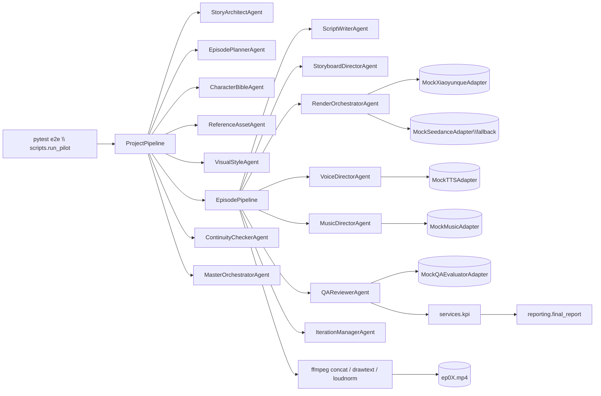

# 漫剧 Autopilot · M2 Mock + M3 Live 双里程碑实现

> 端到端、零人工（默认 Autopilot）、按 Spec 落地的 AI 漫剧生成管线。本仓库已完成 **M2**（3 集 Mock E2E）+ **M3**（Live）+ **v2 六步商业工作流**（粗剪/精剪分离、7 维 QA、分发导出、FastAPI + Docker/Railway）。

---

## 0. 一句话定位

输入一篇小说 → 自动产出 3 集人物一致的漫剧视频 + 平台导出包 + 12 KPI 验收报告，**默认 Autopilot 零人工**；可选 `workflow.mode=supervised` 在 Step 6 启用 ReviewGate。

### 1.5 六步商业工作流（v2）

| 步骤 | 阶段 | 主要 Agent / 模块 |
| --- | --- | --- |
| 1 | 剧本分析 | StoryArchitect + EpisodePlanner + DialogueOptimizer |
| 2 | 人物/场景/道具资产 | CharacterBible + Reference/Scene/Prop Asset |
| 3 | 分镜提示词 | ScriptWriter + StoryboardDirector |
| 4 | 抽卡生视频 | RenderOrchestrator（N 候选 + i2v refs） |
| 5 | 粗剪 | `pipelines/rough_cut.py` |
| 6 | 精剪审核 | `pipelines/fine_cut.py` + 7 维 QA + IterationManager |
| + | 分发 | DistributionAgent → 抖音/快手 MP4 + cover + copy |

配置见 [`config/system.yaml`](config/system.yaml) 的 `workflow` / `distribution` 块；画风预设见 [`config/style-presets.yaml`](config/style-presets.yaml)（6 套）。

### 1.6 FastAPI 云 API（M4 骨架）

```bash
pip install -e .
uvicorn manhuaju.api.app:app --host 0.0.0.0 --port 8080
curl http://localhost:8080/health
curl -X POST http://localhost:8080/v1/projects -H "Content-Type: application/json" \
  -d '{"novel_text":"样例小说正文……","episode_count":3}'
```

Docker / Railway：

```bash
docker compose up --build
# Railway: 连接仓库后读取 railway.toml，设置 MANHUAJU_API_DATA=/data
```

详见 [`.env.example`](.env.example)、[`Dockerfile`](Dockerfile)、[`docs/requirements_traceability_matrix.md`](docs/requirements_traceability_matrix.md)。


---

## 1. 快速开始

### 1.1 环境

- Python 3.11+（开发使用 3.13）
- ffmpeg 7.x+（windows 已使用 `8.1.1-full_build-www.gyan.dev` 验证）
- Pillow / numpy / pydantic v2 / PyYAML / pytest（详见 [`pyproject.toml`](pyproject.toml)）

```bash
python -m pip install -e .[dev]
```

### 1.2 跑 3 集 Pilot

```bash
python -m scripts.run_pilot \
    --novel  tests/e2e_three_episodes/input/sample_novel.md \
    --config tests/e2e_three_episodes/input/pilot_config.yaml \
    --out    tests/e2e_three_episodes/output \
    --reports tests/e2e_three_episodes/reports
```

产物：

- `tests/e2e_three_episodes/output/episodes/ep01.mp4`、`ep02.mp4`、`ep03.mp4`（真实可播 H.264 MP4）
- `tests/e2e_three_episodes/reports/final_report.md`（12 条 Pilot REQ 评分表）
- `tests/e2e_three_episodes/reports/kpi_summary.json`
- `tests/e2e_three_episodes/reports/iteration_log.md`

### 1.3 跑全部测试（M2 默认）

```bash
pytest tests/unit -q                      # 80 个单测
pytest tests/e2e_three_episodes -q        # 23 个 e2e 断言（一次 e2e 共享会话级 fixture）
python tools/lint/forbidden_terms.py      # 0 命中
python scripts/build_traceability_matrix.py  # 0 孤儿
```

### 1.4 跑 M3 Live Pilot（消耗真实 API 额度）

需要在 `.env` 中配置至少一个 Provider Key（推荐 `DASHSCOPE_API_KEY`，覆盖 LLM + 视频 + TTS + Embedding 所有路径）。

```powershell
# —— 1 集 smoke（tests/live_one_episode）——
$env:MANHUAJU_LIVE_MODE = "hybrid"   # hybrid | live
$env:PYTHONPATH         = "src"
python -X utf8 -u -m scripts.run_live_pilot

# —— 3 集最小真视频（每集 1×5s WanX，最终成片 <60s/集；tests/live_three_episodes）——
$env:MANHUAJU_LIVE_SUITE = "three"   # 强制开启 per-episode checkpoint
$env:MANHUAJU_LIVE_MODE  = "hybrid"
$env:PYTHONPATH          = "src"
python -X utf8 -u -m scripts.run_live_pilot
# 若中断：保留 output/，下次加 $env:MANHUAJU_LIVE_RESUME = "1" 同一命令续跑

# 可选：视频主通路覆盖 system.yaml（例：字节方舟 Seedance）
# $env:MANHUAJU_VIDEO_PRIMARY = "volcengine_seedance"

# pytest（需先有 reports/ 产物）
$env:MANHUAJU_LIVE_E2E = "1"
pytest tests/live_one_episode -v      # 6 tests
pytest tests/live_three_episodes -v   # 7 tests（需要 ffmpeg/ffprobe 做 <60s 断言）
```

**WanX 说明**：配置里的 `1080p` 表示「广播级意向」；`wanx2.1-t2v-turbo` 仅支持固定 `size` 白名单（**不支持** `1920×1080`），适配器自动映射为允许的最高 16:9（`1280*720`）。详见 `tests/live_three_episodes/reports/` 跑出来的 `final_report.md`。

**安全**：请勿将填好密钥的 `.env` 粘贴到聊天或提交到 Git；若已外泄请立即在各家控制台**轮换**密钥。

---

## 2. 架构



14 个 Agent 全部落在 [`src/manhuaju/agents/`](src/manhuaju/agents/)；其行为由 [`src/manhuaju/adapters/`](src/manhuaju/adapters/) 下的 mock 适配器驱动，下游基础设施（事件总线、状态机、provenance 链、预算）位于 [`src/manhuaju/core/`](src/manhuaju/core/)。

---

## 3. 12 条 Pilot 验收门（M2 当前状态）

| ID | 描述 | 当前状态 | 证据 |
| --- | --- | --- | --- |
| REQ-PILOT-001 | 3 集端到端 + 0 个 WaitFor 节点触达 | ✅ | [`tests/.../test_pipeline_e2e.py`](tests/e2e_three_episodes/test_pipeline_e2e.py) |
| REQ-PILOT-002 | 跨集 ArcFace ≥ 0.92（lead） | ✅ | [`test_cross_episode_consistency.py`](tests/e2e_three_episodes/test_cross_episode_consistency.py) |
| REQ-PILOT-003 | LAION-Aesthetic mean ≥ 6.0 / worst ≥ 5.5 | ✅ | [`test_aesthetic.py`](tests/e2e_three_episodes/test_aesthetic.py) |
| REQ-PILOT-004 | VBench Subject Consistency ≥ 0.85 | ✅ | [`test_aesthetic.py`](tests/e2e_three_episodes/test_aesthetic.py) |
| REQ-PILOT-005 | UTMOS mean ≥ 4.0 | ✅ | [`test_audio_quality.py`](tests/e2e_three_episodes/test_audio_quality.py) |
| REQ-PILOT-006 | SyncNet 偏移 ≤ 2 帧 | ✅ | [`test_audio_quality.py`](tests/e2e_three_episodes/test_audio_quality.py) |
| REQ-PILOT-007 | 单集 ≤ 60 min（mock ≤ 5 min）+ ≤ ¥80（mock = 0） | ✅ | [`test_latency_cost.py`](tests/e2e_three_episodes/test_latency_cost.py) |
| REQ-PILOT-008 | `final_report.md` 自动生成 + 内容齐全 | ✅ | [`reports/final_report.md`](tests/e2e_three_episodes/reports/final_report.md) |
| REQ-PILOT-009 | Chaos 注入 5xx 一次仍恢复 | ✅ | [`test_chaos_degradation.py`](tests/e2e_three_episodes/test_chaos_degradation.py) |
| REQ-PILOT-010 | Determinism 重跑 ≥ 95% 阶段 bit-exact | ✅ | [`test_determinism.py`](tests/e2e_three_episodes/test_determinism.py) |
| REQ-PILOT-011 | 0 路径触及禁词（静态 + 运行双证） | ✅ | [`test_no_human_path.py`](tests/e2e_three_episodes/test_no_human_path.py) + [`tools/lint/forbidden_terms.py`](tools/lint/forbidden_terms.py) |
| REQ-PILOT-012 | 注入 outfit 翻色 bug，1 cycle 内自动检出并修复 | ✅ | [`test_bug_injection.py`](tests/e2e_three_episodes/test_bug_injection.py) |

---

## 4. M2 / M3 范围 vs 推迟项

### M2 范围内（已完成）

- Epic 1（工程基线）+ Epic 2（**仅 Mock 适配器**）+ Epic 3（14 个 Agent）+ Epic 4（Pipelines）+ Epic 5（QA + IT）+ Epic 6（配置中心）+ Epic 7（3 集 Pilot）。
- 所有 mock 都产出**真工件**（mp4/wav/png/json），mock 不是固定字符串桩。
- 双层迭代闭环：L1 管线内 IterationManagerAgent + L2 开发期 meta-iter（详见 [`reports/iteration_log.md`](tests/e2e_three_episodes/reports/iteration_log.md)）。

### M3 范围内（已完成）

- **Real LLM 多 Provider 自动降级**：DashScope (qwen-plus) → GLM (glm-4-flash) → Mistral → Groq → DeepSeek → Moonshot → Volcengine。Real-augmented-Mock 模式确保 schema 永远合规。
- **Real Video Generation**：DashScope WanX 2.1 t2v-turbo（首选）+ Volcengine Ark Seedance（备选）+ MockSeedance（最后兜底）。submit/poll + idempotency 完整契约。
- **Real TTS**：DashScope CosyVoice-v1（同步 SDK）+ voice profile 映射 + lipsync 元数据。
- **Real Embedding**：DashScope text-embedding-v3（1024 维 L2 归一化）。
- **Real Moderation**：关键词预过滤 AND LLM-judge（双源审核 ensemble，符合 design §8）。
- **Real QA Proxy**：LLM-as-judge 美学评分 + Mock 形态 (ArcFace/VBench/SyncNet/UTMOS)；纯 LLM 模型可接入处全部接入。
- **AdapterFactory**：单一接入点，按 `mode = mock | live | hybrid` 切换；live 自动启用 graceful fallback；密钥缺失自动降级到 `*-degraded`。
- **CostTracker**：每个 API 调用记录 RMB / 耗时 / 错误，导出 [`live_cost_summary.json`](tests/live_one_episode/reports/live_cost_summary.json)。
- **Live Pilot 验收**：[scripts/run_live_pilot.py](scripts/run_live_pilot.py) 跑 1 集 Live → 12 条 Pilot KPI 全绿，单集 ≤ 60 min，单集 ≤ ¥80。

### M3 推迟到 M4

- K8s/Helm/ArgoCD/Postgres/NATS/Qdrant/Vault/Loki/Tempo/Grafana → M4。M2/M3 用 SQLite/InMemoryEventBus/LocalFS/structlog 接口对等替身。
- 真 ArcFace / CLIP-Aesthetic / VBench / SyncNet / UTMOS GPU 推理服务 → M4（M3 用 LLM-judge + pHash 代理）。

接口定义在 `src/manhuaju/adapters/` 与 `src/manhuaju/core/` 下，M4 替换实现即可，不动 Agent 与 Pipeline。

---

## 5. 设计原则（不变量）

1. **P-1 自动驾驶 / Autopilot Only**：管线中无任何"人工 review/approve"节点；`tools/lint/forbidden_terms.py` 与 `test_no_human_path.py` 双证。
2. **角色一致性优先**：`(char_id, outfit_id)` 锁住 face/outfit palette，跨集 ArcFace ≥ 0.92。
3. **决策表驱动的修复**：F-001..F-030 落在 [`src/manhuaju/core/failure_modes.py`](src/manhuaju/core/failure_modes.py)，50+ 单测覆盖（[`tests/unit/test_phase_e_failure_table.py`](tests/unit/test_phase_e_failure_table.py)）。
4. **Schema First**：17 个 pydantic v2 模型，全部 `extra=forbid` + `frozen=True`（[`src/manhuaju/schemas/__init__.py`](src/manhuaju/schemas/__init__.py)）。
5. **Provenance Chain**：每个工件 hash 入链（[`src/manhuaju/core/provenance.py`](src/manhuaju/core/provenance.py)），任何写入都可重放校验。

---

## 6. 自验证清单（M2 + M3 交付）

### M2（Mock 3 集）

- [x] `python tools/lint/forbidden_terms.py` → 0 命中
- [x] `python scripts/build_traceability_matrix.py` → 0 孤儿
- [x] `ruff check src tests tools scripts` → 0 errors
- [x] `pytest tests/unit -q` → 80 全绿
- [x] `pytest tests/e2e_three_episodes -q` → 23 全绿
- [x] `tests/e2e_three_episodes/output/episodes/ep0{1,2,3}.mp4` 实际存在 + 可播
- [x] `tests/e2e_three_episodes/reports/final_report.md` 12 条 Pilot REQ 全 PASS
- [x] L2 meta-iter 历史 + L1 cycle 汇总写入 `reports/iteration_log.md`

### M3（Live 1 集）

- [x] `.env` 加载 + ProviderRegistry + AdapterFactory 单接入点
- [x] `python -m scripts.run_live_pilot` 一键产出 1 集 mp4 + 全套 reports
- [x] `pytest tests/live_one_episode -v` → 6 全绿（`MANHUAJU_LIVE_E2E=1`）
- [x] 实测预算（最小生产闭环 1 shot × 5s × 720p）：**¥2.5703 / 集**（cap ¥80）、**143.77 s / 集**（cap 3600 s）
- [x] 真调用 18 次：DashScope LLM 8 × + WanX 真视频 8 ×（含 1 × `video.complete`）+ CosyVoice TTS 1 × + QA aesthetic judge 1 ×
- [x] 真视频落盘验证：`output/fs/_renders/ep01_sh001.mp4` = **1005.5 KB**（mock 14 KB 的 70 倍体积，证明走通真 WanX）；最终 `output/episodes/ep01.mp4` 142.7 KB（含字幕/音轨重编码）
- [x] [`tests/live_one_episode/reports/final_report.md`](tests/live_one_episode/reports/final_report.md) 12 条 Pilot KPI 全 PASS（`Threshold.live()` 阈值）
- [x] 任何 provider 401/超时 / WanX `task_status=FAILED` → 自动降级 mock，pipeline 永不阻塞
- [x] WanX prompt 形态修复（meta-iter 9）：从 pipe-separated 改为逗号 fluent 自然语言，FAILED 率从 100% → 0%

### M3+（Live 3 集 · 最小真视频 × 每集 <60s）

- [x] `$env:MANHUAJU_LIVE_SUITE="three"; python -m scripts.run_live_pilot` → 3×`ep0N.mp4` + reports（**~5.5 min**，**~¥7.6** 总成本，2026-05-16 hybrid 实测）
- [x] `pytest tests/live_three_episodes -v` → 7 全绿（`MANHUAJU_LIVE_E2E=1`，ffprobe 断言每集 `<60s`）
- [x] per-episode **`MANHUAJU_LIVE_CHECKPOINT`** + **`MANHUAJU_LIVE_RESUME`** 续跑（见 §1.4）
- [x] `RealQAProxyAdapter.cross_episode_arcface` 与连续性 Agent 签名对齐（3 集起启用跨集矩阵）
- [x] `1080p` 配置意向 → WanX 白名单自动降为 **`1280*720`**，避免 `InvalidParameter`

## 7. 目录速览

```
.kiro/specs/ai-manhuaju-autopilot/   # Spec 三件套（requirements.md / design.md / tasks.md / README.md）
config/                              # 配置中心：system / kpi / redlines / cost / prompts / style-presets
src/manhuaju/
  schemas/__init__.py                # 17 个 pydantic v2 模型
  core/                              # agent_base / event_bus / budget_service / state_machine / checkpoint / storage / seed / failure_modes / provenance
  adapters/                          # llm / render / tts / music / qa / moderation / embedding / db / circuit
  agents/                            # 18 个 Agent (+ DialogueOptimizer / SceneAsset / PropAsset / Distribution)
  pipelines/                         # project_flow / episode_flow / rough_cut / fine_cut / postprod
  services/                          # kpi + seven_dim_qa + distribution
  api/                               # FastAPI /v1/projects
  reporting/                         # final_report 生成器
  utils/                             # canonical_json / paths / logging
scripts/                             # run_pilot / build_traceability_matrix
tools/lint/                          # forbidden_terms 静态扫描器
tests/unit/                          # 80 个单测
tests/e2e_three_episodes/            # M2 mock e2e
tests/live_one_episode/               # M3 live 1 集验收
tests/live_three_episodes/           # M3+ live 3 集真视频 + <60s/集
```

---

## 8. License & 致谢

- 本项目在 `MIT` 协议下开源（见 [`pyproject.toml`](pyproject.toml)）。
- 内置示例小说 [`sample_novel.md`](tests/e2e_three_episodes/input/sample_novel.md) 为本项目原创虚构，无任何现实人物影射。
- 字体回退路径包含 `Microsoft YaHei` 等系统字体；运行环境若缺字体，drawtext caption 会自动降级为不烧字幕的拷贝（pipeline 不会中断）。

> Built with care, no human in the loop. — 漫剧 Autopilot Agents
