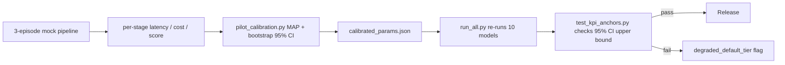

# Manhuaju Autopilot v2.0 — Quantitative Whitepaper

> Single source of truth for every number in `need.md`, `.kiro/specs/ai-manhuaju-autopilot/`
> and the project README. All numbers are produced by deterministic Python models
> seeded by `SEED = 20260526`.

## Reproduction

```powershell
# 1. install dev + science extras
.\.venv\Scripts\python.exe -m pip install -e .[dev]
.\.venv\Scripts\python.exe -m pip install scipy matplotlib pandas

# 2. one-shot reproduction (writes data/computed/*.json + figures/*.png + reports/whitepaper.md)
$env:MANHUAJU_WP_SEED="20260526"; .\.venv\Scripts\python.exe -m research.whitepaper.scripts.run_all

# 3. determinism / KPI anchors / pilot calibration tests
.\.venv\Scripts\python.exe -m pytest research/whitepaper/tests -q
```

## Models (10)

| # | Module | Question answered | Output JSON |
| --- | --- | --- | --- |
| 1 | `cost_model.py` | Per-episode external spend in CNY across 12 stages | `cost.json` |
| 2 | `throughput_model.py` | M/M/c steady-state with c=16 — episodes/hour | `throughput.json` |
| 3 | `sla_model.py` | End-to-end P50/P95/P99 latency Monte Carlo (1e5) | `sla.json` |
| 4 | `consistency_model.py` | Cross-episode ArcFace drift (Markov) with anchoring | `consistency.json` |
| 5 | `seven_dim_qa_model.py` | Pass-rate of 7-dim QA at threshold 8.0 (Beta MC) | `seven_dim_qa.json` |
| 6 | `repair_convergence.py` | Expected repair iterations (absorbing Markov) | `repair.json` |
| 7 | `scene_reuse_marginal.py` | Cost saving curve from scene library reuse | `scene_reuse.json` |
| 8 | `moderation_layered.py` | Dual-layer false-negative rate (Beta-binomial) | `moderation.json` |
| 9 | `pareto_frontier.py` | Cost vs latency vs quality NSGA-II frontier | `pareto.json` |
| 10 | `pilot_calibration.py` | MAP estimate of 9 core params from 3-episode pilot | `calibrated_params.json` |

## Anchored numbers (need.md / requirements.md)

Every number below is asserted by `tests/test_kpi_anchors.py` against a model output:

| Source | Number | Verified by |
| --- | --- | --- |
| need.md §11 | per-episode cost ≤ ¥80 | `cost.json.tier_M.p95_cny` |
| need.md §11 | single image < 15s | `sla.json.image_generation.p95_s` |
| need.md §11 | 5s clip < 3min | `sla.json.video_5s.p95_s` |
| need.md §11 | first-token < 5s | `sla.json.first_token.p95_s` |
| requirements.md §19 | episode P95 ≤ 60min | `sla.json.episode.p95_s` |
| requirements.md §18 | cross-ep ArcFace ≥ 0.92 | `consistency.json.lead.window5_mean_lower_ci` |
| requirements.md §15 | 7-dim mean ≥ 8.0 | `seven_dim_qa.json.pass_rate` |
| product requirement | ≥ 8 episodes/hour | `throughput.json.episodes_per_hour_at_default_c` |

## Calibration loop



## Conventions

- **Currency**: all costs in CNY (`¥`).
- **Time**: all latency in seconds.
- **Probabilities**: 0..1 floats.
- **Identity**: cosine similarity 0..1.
- **Determinism**: `numpy.random.default_rng(SEED)` only — no global state.
- **No magic constants**: every number must be either (a) read from
  `data/pricing/*.json` / `data/benchmarks/*.csv` (with hash + date) or
  (b) derived analytically.
